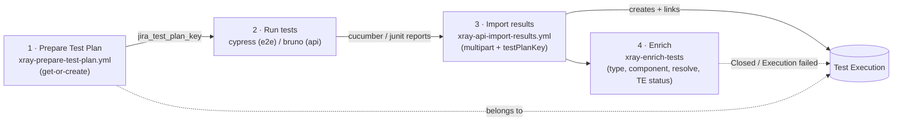
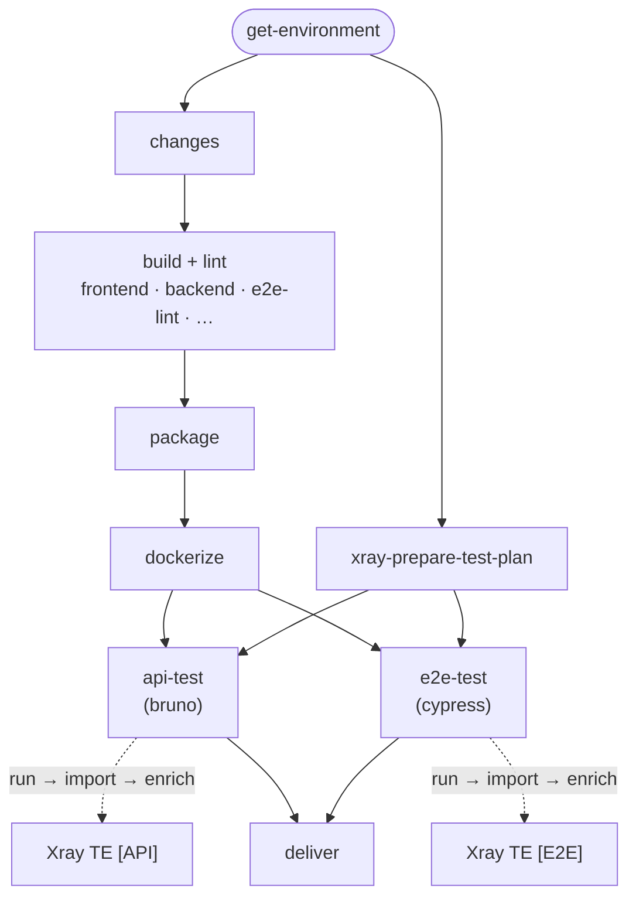
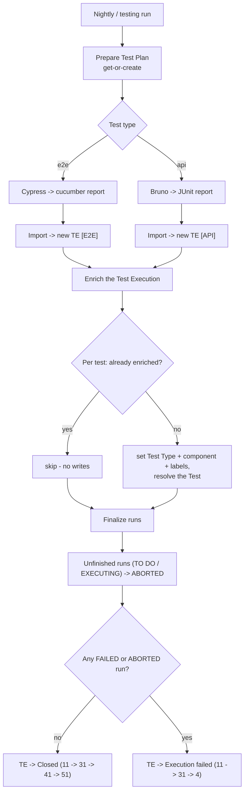
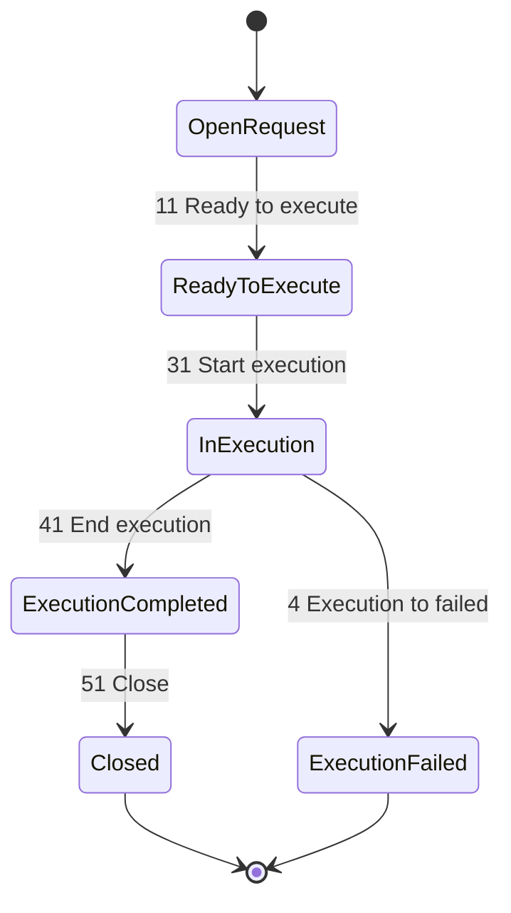
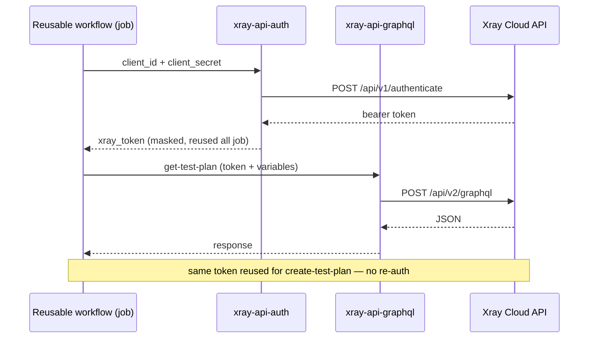

# Xray / Jira test result integration

Reusable building blocks that link CI test runs to Xray Test Plans / Test Executions.
The design favours small, single-responsibility composite actions and GraphQL queries kept
in versioned `.graphql` files, so the flow stays maintainable by the QA team.

> **Visual one-pager** — [`xray-flow-pipeline.html`](./xray-flow-pipeline.html) is a standalone, styled
> view of the whole pipeline (stages, the test-job zoom, run/TE states and Test Plan naming). GitHub shows
> it as source; download it or open it locally in a browser.
>
> **Keep in sync** — when this flow changes (stages, transitions, statuses, Test Plan naming), update
> **both** the Mermaid diagrams below **and** `xray-flow-pipeline.html`.

## Pipeline



> Each run **creates a new Test Execution** (the import passes `xrayFields.testPlanKey`, not
> `testExecKey`), so re-running a job yields a new TE; the Test Plan aggregates the latest result
> per test. e2e (cucumber) and api (bruno) run in parallel, each importing + enriching its own TE
> (`[E2E] …` and `[API] …`). The whole flow runs only on **nightly/testing**, never on PRs.

## GitHub Actions job graph

How the pipeline maps onto the module workflow jobs (`web.yml`, `awie.yml`, `open-tickets.yml`) and their
`needs` dependencies. The two test jobs each call a reusable workflow that runs the tests, then
imports and enriches its own Test Execution.



> `package` waits on the whole build+lint set; `dockerize` waits on `package`; each test job also
> waits on `xray-prepare-test-plan` (for the plan key) and `dockerize` (for the image). The
> import + enrich happen **inside** each test job's reusable workflow, not as separate top-level jobs.

## Flow & cases at a glance

End-to-end decision flow, including the enrichment shortcuts (skip already-enriched tests,
abort unfinished runs) and the pass/fail routing of the Test Execution:



## Enrichment (`xray-enrich-tests`)

After the import, `xray-enrich-tests` runs on the freshly created Test Execution:

- **Per test** (each step is skipped when already satisfied, so repeat runs are near-instant):
  - Xray **Test Type** — set, then **verify + retry once** (Xray can silently keep a just-imported
    test as `Generic`); e.g. `API` for JUnit results.
  - Jira **component** (the module) and **labels** — component replaces, labels are additive.
  - **Resolve** the Test issue (walk to `Resolved`).
- **Per run** (the Test Execution itself):
  - Mark every unfinished run (`TO DO` / `EXECUTING`, e.g. a crashed job that produced no result)
    as **ABORTED** via `updateTestRunStatus`, so no "in progress" run lingers.
  - Move the Test Execution to its terminal status based on the outcome (see below).

Xray is **eventually consistent**, so the action is defensive everywhere: it filters `null` test
entries, verifies the test type took, and reads current state to skip already-enriched tests.

The same action is also exposed as a manual workflow, `xray-enrich-tests-backfill.yml`
(`workflow_dispatch`), to enrich an existing **Test Plan / Test Execution / JQL** — used to
retro-fit historical tests that predate this flow.

## Test Execution lifecycle & result routing

The enrichment drives the Test Execution through its Jira workflow to a terminal status that
reflects the run outcome — **`Closed`** when everything passed, **`Execution failed`** when at
least one run failed or was aborted.



| Run outcome                   | Transitions followed | Final status       |
| ----------------------------- | -------------------- | ------------------ |
| All tests **PASSED**          | `11 → 31 → 41 → 51`  | `Closed` (Done)    |
| Any test **FAILED / ABORTED** | `11 → 31 → 4`        | `Execution failed` |

The walk follows **named** transitions and never takes the trap transitions the workflow also
exposes (`BLOCKED` — global —, `WAITING DELIVERY/DECISION/FIX`, `BACK TO …`); those stay manual.
Run-level results (`PASSED`/`FAILED`/`ABORTED`) come from the **import**, not the enrichment.

## One token per job

Every reusable workflow authenticates **once** at the start of its job and reuses the bearer
token for all subsequent Xray calls. The token is registered with `::add-mask::` so it never
appears in logs.



## Building blocks

| Composite action             | Responsibility                                                                                                             |
| ---------------------------- | -------------------------------------------------------------------------------------------------------------------------- |
| `xray-api-auth`              | Authenticate once, return a masked bearer token                                                                            |
| `xray-api-graphql`           | Run a GraphQL operation from a versioned `.graphql` file                                                                   |
| `xray-prepare-graphql-vars`  | Assemble the normalized GraphQL variables bag                                                                              |
| `jira-generate-summary`      | Build the Jira summary (TEST_PLAN / TEST_EXECUTION)                                                                        |
| `xray-normalize-environment` | Normalize component / OS / DB / browser / environment                                                                      |
| `xray-enrich-tests`          | Enrich imported Tests (component, labels, Xray Test Type, resolve) — Xray GraphQL for Xray data, Jira REST for Jira fields |

| Reusable workflow             | Responsibility                                                                                      |
| ----------------------------- | --------------------------------------------------------------------------------------------------- |
| `xray-prepare-test-plan.yml`  | Get-or-create the Test Plan, output its key + issue id                                              |
| `xray-api-import-results.yml` | Import Cucumber (e2e) or JUnit (api/bruno) results, creating the Test Execution under the Test Plan |

| Helper script                                 | Responsibility                                                                                                                                                                     |
| --------------------------------------------- | ---------------------------------------------------------------------------------------------------------------------------------------------------------------------------------- |
| `scripts/xray/merge-junit.js`                 | Merge per-collection JUnit reports and normalize each testcase name to `[API] <folder> > <request> - <assertion>`, so the resulting Xray Tests are identifiable and collision-free |
| `scripts/xray/build-test-execution-fields.js` | Build the Test Execution Jira fields payload (summary, components, environments) for the import endpoint                                                                           |

Each composite action keeps its GraphQL operations as versioned `.graphql` files next to it,
one **named** operation per file (e.g. `xray-api-graphql/*.graphql`, `xray-enrich-tests/*.graphql`).

## Wiring a module

```yaml
jobs:
  xray-prepare-test-plan:
    uses: ./.github/workflows/xray-prepare-test-plan.yml
    with:
      major_version: ${{ needs.get-environment.outputs.major_version }}
      operating_system: ${{ matrix.operating_system }}
      module_name: centreon-<module>
    secrets:
      XRAY_CLIENT_ID: ${{ secrets.XRAY_CLIENT_ID }}
      XRAY_CLIENT_SECRET: ${{ secrets.XRAY_CLIENT_SECRET }}

  e2e-test:
    needs: [xray-prepare-test-plan, ...]
    uses: ./.github/workflows/cypress-e2e-parallelization.yml
    with:
      jira_test_plan_key: ${{ needs.xray-prepare-test-plan.outputs.jira_test_plan_key }}
      # jira_component_name: only when the module directory differs from its Jira
      # component (e.g. the `centreon` directory maps to the `centreon-web` component).
      # ...
```

The `cypress-e2e-parallelization.yml` workflow then calls `xray-api-import-results.yml`
internally once the tests have produced their Cucumber reports.

## Notes

- A scenario is linked to its Xray Test through a `@MON-<key>` tag. Modules whose e2e
  features are not tagged (e.g. `centreon-awie`) are left unwired from the Xray flow until
  their Tests are created — see the auto-provisioning follow-up (MON-204235).
- The import matches the Cypress cucumber report under either `report.json` or
  `cucumber-report.json` inside the `xray-reports` artifact.
