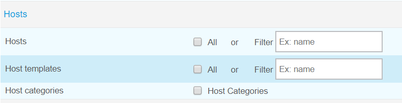

**************************************
Export configured Centreon Web objects
**************************************

Once you have configured properly all Centreon Web objects you need (Poller, Hosts, Services, Contacts, Time Periods... ) then you can export them forward another Centreon Web platform by going to:

Configuration > Import/Export

Default page is Export one.

.. image:: _static/images/exportdefault.png
   :align: center

Poller Export 
=============

.. image:: _static/images/poller.png
   :align: center

If you set the *All* check-box to yes (default value is no) then all configured pollers will be exported with their configuration files (for engine, broker...) after you have clicked on *Export* button.

If you want to export only one poller then type its **exact** name in *Filter* field (one single value is accepted, this field has no list of items proposed).

Hosts Export
============

**Hosts**

.. image:: _static/images/hosts.png
   :align: center

Same principle as Poller export but :

If you choose to export all hosts, then hosts configurations, linked hosts templates and linked services templates will be exported but hosts will be created in target environment without their services.
However, you will be able to create services by selecting value "Yes" for the *Create Services linked to the Template too* radio-button in Configuration > Hosts page, for each host. Save host configuration and export configuration.

If you export a specific host by using the *Filter* field (only one host at the same time) then the host will be created in the new platform with all its services.

**Host templates**

.. image:: _static/images/hoststemplates.png
   :align: center

Check the *Hosts templates* check-box if you want to export all hosts templates. 

Use the *Filter* field for one single value if you want to export one specific host template.

**Host categories**  

.. image:: _static/images/hostscat.png
   :align: center

Check the *Host categories* check-box if you want to export all host categories. There is no *Filter* field for this object.

Services Export
===============

.. image:: _static/images/servicesetc.png
   :align: center

**Services**

.. image:: _static/images/services.png
   :align: center

Same principle as Poller export but :

If you use the *Filter* field for a specific service, Import/Export process will create ALL services linked to first host linked to the filtered service.

**Services templates**

.. image:: _static/images/servicestemplates.png
   :align: center

Check the *Service templates* check-box if you want to export all service templates.

Use the *Filter* field for one single value if you want to export one specific service template.

**Service categories**

.. image:: _static/images/servicescat.png
   :align: center

Check the *Service categories* check-box if you want to export all service categories. There is no *Filter* field for this object.

Contacts Export
===============

You can export all Contacts (without linked contacts groups) or all Contacts groups (with linked users). No *Filter*.

Commands Export
===============

.. image:: _static/images/commands.png
   :align: center

Check the check-box corresponding to the type of command you want to export (Check, Notification, Miscellaneous or Discovery). No *Filter*.

.. note:: 
    Commands lines for Discovery commands are not exported entirely (known issue).

Resources Export
================

**ACL**

Check the *ACL* check-box if you want to export ACL objects (Access groups, Menus Access, Resource Access, Actions Access). No *Filter*.

.. note:: 
    Relations between ACL objects are exported  but links between those differents objects are not created once they are imported. 

**LDAP**

Check the *LDAP* check-box if you want to export your LDAP configuration(s). No *Filter*.

**Time periods**

Check the *Timeperiods* check-box if you want to export all time periods. No *Filter*.
