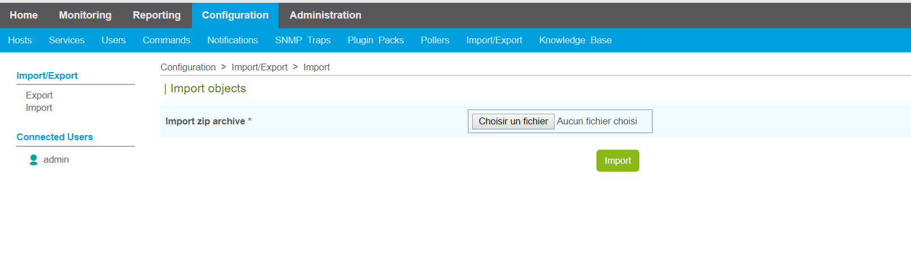
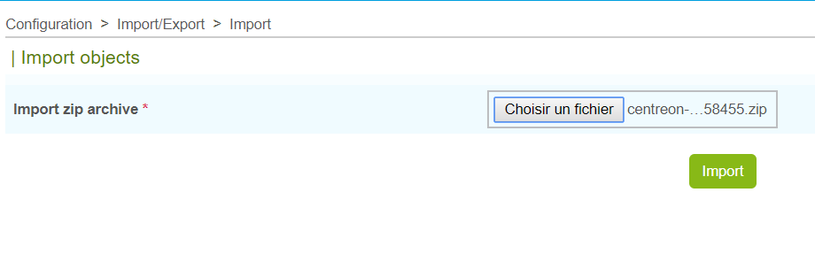
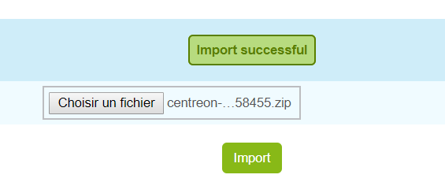

======================================
Import configured Centreon Web Objects
======================================

In the Export page, each time that the Export button is pressed, a zip archive file is created and downloaded.

This is the file that you will upload in the Import Page of another Centreon Web platform.

Go to **Configuration > Import/Export > Import** menu:

Select the centreon-clapi-export zip file you want to import then click on the *Import* button:

You should get "Import successful" message at the end of the process:

To check that objects have been properly imported, go to Configuration pages as usual.

.. note::
    It is necessary to generate, test and export configuration.
