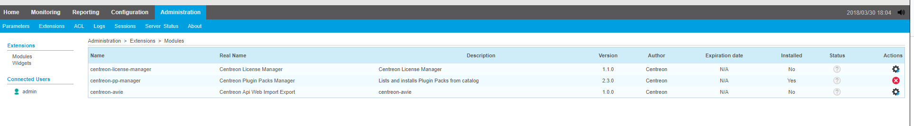
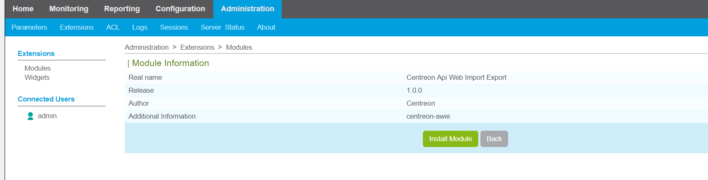
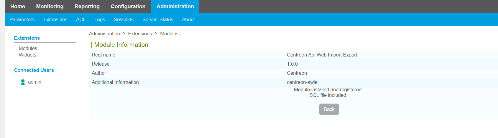

############
Installation
############

Centreon recommends using its official packages.

**Using packages**

Centreon provides RPM for its products through Centreon Entreprise Server (CES). Open source products are freely available from our repository.

These packages are available for CentOS 6 and CentOS 7.

Install package
===============

Run the following commands as privileged user.

For CentOS 6::

  $ yum install centreon-awie-1.0.0-1.el6.noarch.rpm

For CentOS 7::

  $ yum install centreon-awie-1.0.0-1.el7.noarch.rpm

All dependencies are automatically installed from Centreon repositories.

UI installation
===============

Log into your Centreon Web platforms (source and target).

Go to Administration > Extensions > Modules.

Click on "Install module" wheel icon at the end of the centreon-awie line: 

Click on the *Install module* button:

Click on *Back* button to finish installation:

