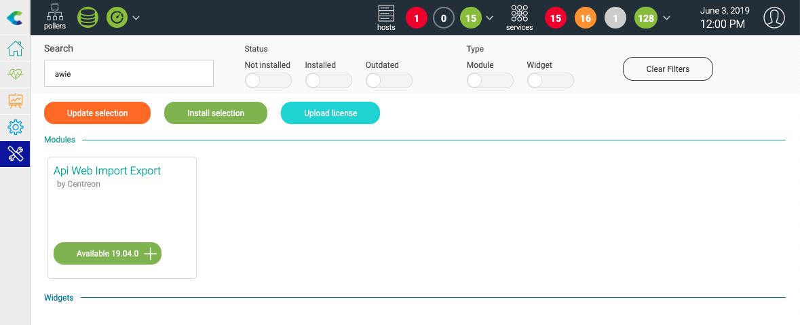
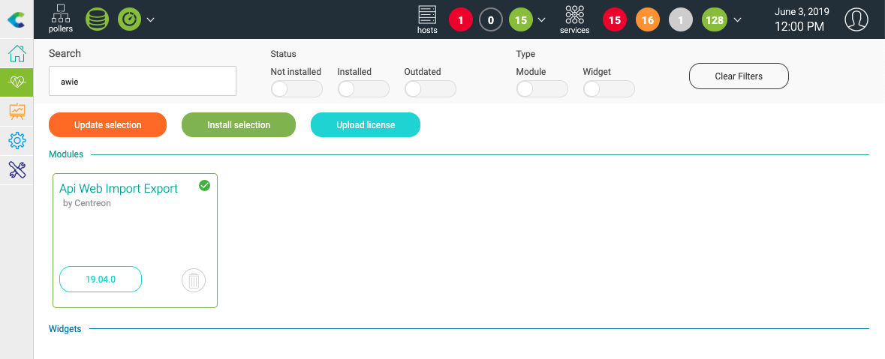

############
Installation
############

Installing packages
===================

Run the following commands as a privileged user: ::

    # yum install centreon-awie

UI installation
===============

Go to **Administration > Extensions > Manager** and search **awie**. Click
on **Install selection**:

Your module is now installed:

