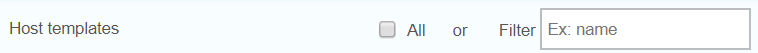
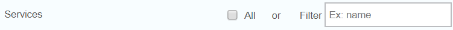
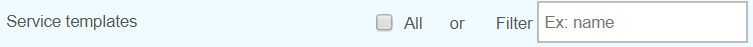

*******************************************
Exporter des objets Centreon Web configurés
*******************************************

Une fois que vous avez configuré correctement tous les objets Centreon Web dont vous avez besoin (Poller, Hôtes, Services, Contacts, Périodes temporelles...), vous pouvez alors les exporter vers une autre plateforme Centreon Web en vous rendant dans le menu :

Configuration > Import/Export

La page s'affichant par défaut est celle de l'export.

Export des collecteurs de supervision 
=====================================

Si vous cochez la case à cocher *All* alors tous les collecteurs configurés seront exportés avec leurs fichiers de configuration (pour engine, broker...), lorsque vous aurez cliqué sur le bouton *Export*.

Si vous voulez exporter seulement un poller alors saisissez son nom **exact** dans le champ *Filter* (une seule valeur possible, pas de liste de valeurs proposée).

Export des hôtes
================

.. image:: _static/images/hostsetc.png
   :align: center

**Hôtes**

Même principe de fonctionnement que pour l'export des collecteurs mais :

Si vous choisissez d'exporter tous les hôtes, alors les configurations d'hôtes, les modèles d'hôtes liés et les modèles de service liés seront exportés mais les hôtes seront créés dans l'environnement cible sans leurs services.
Cependant, vous aurez la possibilité de créer les services en cochant le bouton-radio "Créer aussi les services liés au modèle" dans la page Configuration > Hôtes, pour chaque hôte. Sauvez la configuration et exportez la configuration.

Si vous exportez un hôte en particulier en utilisant le champ *Filter* (un seul hôte à la fois) alors l'hôte sera créé dans la nouvelle plateforme avec tous ses services.

**Modèles d'hôte**

Cochez la case *Host templates* si vous désirez exporter tous les modèles d'hôtes.

Utilisez le champ *Filter* pour une seule valeur si vous souhaitez exporter un modèle d'hôte en particulier.

**Catégories d'hôte**  

Cochez la case "Host categories" si vous voulez exporter tous les catégories d'hôte. Il n'y a pas de champ *Filter* pour cet objet.

Export des services
===================

.. image:: _static/images/servicesetc.png
   :align: center

**Services**

Même principe que pour l'export des collecteurs de supervision mais : 

Si vous utilisez le champ *Filter* pour un service spécifique, le processus d'Import/Export créera TOUS les services liés au premier hôte lui-même lié au service filtré.

**Modèles de service**

Cochez la case *Service templates* si vous souhaitez exporter tous les modèles de service.
 
Utilisez le champ *Filter* pour une seule valeur si vous voulez exporter un modèle de service spécifique.

**Catégories de service**

Cochez la case *Service categories* si vous souhaitez exporter toutes les catégories de service. Il n'existe pas de champ *Filter* pour cet objet.

Export des contacts
===================

.. image:: _static/images/contacts.png
   :align: center

Vous pouvez exporter soit tous les contacts (sans les groupes de contacts auxquels ils sont liés), soit tous les groupes de contacts (avec les contacts liés). Pas de filtre.

Export des commandes
====================

.. image:: _static/images/commands.png
   :align: center

Cochez la case correspondant au type de commande que vous souhaitez exporter (Contrôle, Notification, Divers, Découverte). Pas de filtre.

.. note:: 
    Les lignes de commandes de Notification ne sont exportées que partiellement - bug connu.

Export des ressources
=====================

.. image:: _static/images/resources.png
   :align: center

**ACL**

Cochez la case *ACL* si vous souhaitez exporter tous les objets ACL (Groupes d'accès, Accès menus, Accès ressources, Accès Actions). Pas de filtre.

.. note:: 
    Les objets reliés aux ACL sont exportés mais les liens entre les ACL objets  ne sont pas recréés lors de l'import.

**LDAP**

Cochez la case *LDAP* si vous voulez exporter votre (vos) configuration(s) LDAP. Pas de filtre.

**Time periods**

Cochez la case *Timeperiods* si vous voulez exporter toutes les périodes temporelles. Pas de filtre.
