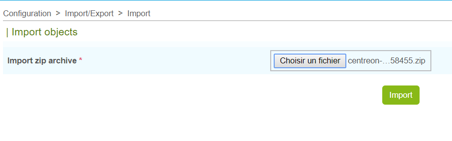

===========================================
Importer des objets Centreon Web configurés
===========================================

Dans la page d'Export, chaque fois que vous pressez le bouton *Export*, un fichier d'archive zippé est créé et téléchargé.

C'est ce fichier que vous sélectionnerez dans la page d'Import d'une autre plateforme Centreon Web.

Allez dans le menu  **Configuration > Import/Export > Import** :

.. image:: _static/images/Import.png
   :align: center

Sélectionnez le fichier centreon-clapi-export.zip que vous souhaitez importer puis cliquez sur le bouton *Import* :

A la fin du traitement vous devriez obtenir le message "Import successful".

Afin de vérifier que tous les objets ont été correctement importés, veuillez consulter les pages habituelles du menu Configuration.

