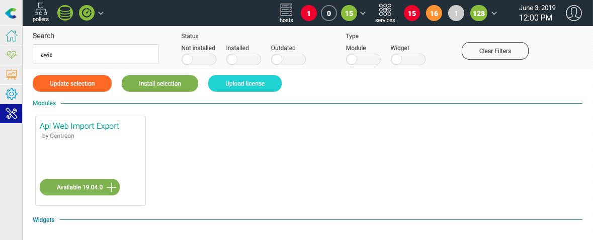
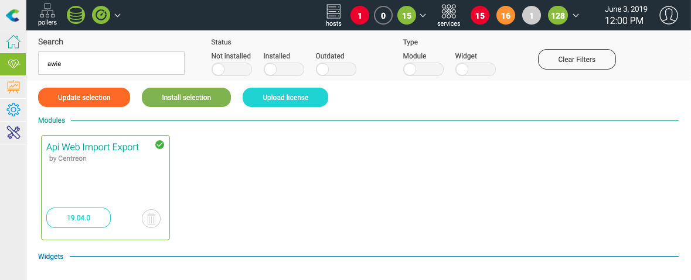

############
Installation
############

Installer les paquets
=====================

Exécutez les commandes suivantes en tant qu'utilisateur avec des droits
suffisants : ::

    # yum install centreon-awie
                
Installation de l'interface utilisateur
=======================================

Rendez-vous au menu *Administration > Extensions > Manager** et recherchez
**awie**. Cliquez sur **Install selection** :

Le module est maintenant installé :

