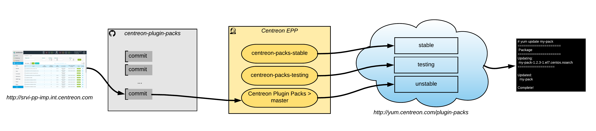

# Centreon Plugin Packs

## Introduction

Centreon Plugin Packs project stores the JSON files used to create the packs
provided by the EPP/IMP module.

### Basic principles

The Plugin Packs are made from a Centreon platform
(<http://srvi-pp-imp.int.centreon.com/>, LDAP credentials) with a specific
exporting module. You can request necessary privileges to @Sims24 / sbomm@centreon.com.

The files exported from this platform are stored on this project to follow
changes and ease continuous integration and delivery to public repositories.

### Continuous integration workflow

The CI is triggered each time a commit is done in the project master branch.



The Jenkins job in charge of building unstable packages is the
[Centreon EPP/Centreon Plugin Packs/master](https://jenkins.centreon.com/view/Centreon%20EPP/job/centreon-plugin-packs/job/master/)
job.

For each successful jobs, packages will be available on the unstable
repositories:

```text
http://yum.centreon.com/plugin-packs/2e83f5ff110c44a9cab8f8c7ebbe3c4f/<version>/<distrib>/unstable/noarch/packs/
```

With `<version>` the version of the Centreon serie, and `<distrib>` the OS
distribution (`el7` or `el8`).

Each time stamped subdirectories represents a successful build.

:warning: Only customers using an offline IMP License can use unstable RPMs. Online licenses can't. 

To make a build goes from unstable to testing, the
[centreon-packs-testing](https://jenkins.centreon.com/view/Centreon%20EPP/job/centreon-packs-testing/) job
should be launched.
This job needs a version and a release number:

* The version is the date of the unstable build considered as the most
  mature,
* The release number is the time of the unstable build considered as the
  most mature.

For each successful jobs, packages will be available on the testing
repositories:

```text
http://yum.centreon.com/plugin-packs/2e83f5ff110c44a9cab8f8c7ebbe3c4f/<version>/<distrib>/testing/noarch/packs/
```

With `<version>` the version of the Centreon serie, and `<distrib>` the OS
distribution (`el7` or `el8`).

To make a build goes from testing to stable, the
[centreon-packs-stable](https://jenkins.centreon.com/view/Centreon%20EPP/job/centreon-packs-stable/)
job should be launched.

It takes the same parameters as the testing job.

Packages are now available on Plugin Packs stable repositories.

## How to create a new Plugin Pack

### Create configuration objects

From the EPP/IMP Centreon Plugin Packs development platform create all
needed objects:

* Commands,
* Service templates,
* Host templates,
* Autodiscovery rules.

### Create Plugin Pack definition

From the *Configuration > Export* menu, add a new definition.

The following fields must be set:

* *Plugin Pack Configuration* tab:
  * *Name*: lower case, same than pkg_name from plugin packaging without
    centreon-plugin,
  * *Display Name*: short name (20 characters max) shown in the Plugin Packs
    Manager,
  * *Status*: Stable, Testing, Development, Experimental, Deprecated,
  * *Icon*: image showing the contructor/editor, 128 by 128 pixels (or
    128\*X or X\*128),
  * *Tags*: tags list for searching purpose. **Mandatory rules:** If Pack contains Service discovery rule(s), add a ServiceDisco tag. If Pack contains Host discovery rule(s), add HostDisco tags. If Pack relates to Security, add Security tags.
  * *Author*: Centreon (set by default),
  * *Email*: imp@centreon.com (set by default),
  * *Web site*: www.centreon.com (set by default),
  * *Discovery type*: EPP category (Applications, Centreon, Databases,
    Network, etc.),
  * *Software Requirement*: name and version of the Centreon Plugins
    packages used by the Pack,
  * *Dependencies*: name and version of the Plugin Packs needed by the Pack,
  * *Plugins requirements*: JSON definition of the Plugins and minimum version they need to run. The structure is described [here](https://centreon.atlassian.net/browse/MON-11986?atlOrigin=eyJpIjoiZDM4NmE2OGEzMTdhNDM1Mjg3MmNkMDhhMDFjZWFmOTgiLCJwIjoiamlyYS1zbGFjay1pbnQifQ)
      * It's a JSON array, containing _n_ plugin requirements. Keys are _executable_name, package_name, package_version_ 

As an example, the applications-activemq-jmx Pack needs this JSON:
```
[{"package_version":"20220516","package_name":"centreon-plugin-Applications-ActiveMQ-Jmx","executable_name":"centreon_activemq_jmx.pl"}]
```

  * *Compatibility*: extra informations.

* *Inclusions/Exclusions* tab:
  * *Inclusions*: include all hosts and services templates,
  * *Exclusions*: generic models (generic-active-host and
    generic-active-service), and models from dependent Packs.

* *Documentation* tab:
  * *Description*: short description of the Pack with a list of the main
    indicators,
  * *Monitoring procedure*: Starting from version 19.10.1 of the
    Plugin Packs Manager, this section is not mandatory anymore. Only
    indicate that a minimum version of the Plugin Packs Manager module is
    required to get access to the documentation (see last created Packs
    for reference)
  
* *Host Discovery Rules* tab: If the Plugin does include a discovery
  mode, follow this internal procedure to create the associated rules:
  <https://centreon.atlassian.net/wiki/spaces/MIAC/pages/633667608/How+to+create+Host+Discovery+Rules>.

At first, the Pack status will be set to *Development*.

### Export Plugin Pack definition

From the *Configuration > Export* menu, export the newly created Pack with
the export action on the right.

On the pop-up, the following fields must be set:

* *Version*: version of the pack on a 3 digits format (x.x.x),
* *Status*: status of the pack,
* *Status message*: short message decribing changes,
* *Changelog*: detailed message describing changes.

At first, the Pack version will be set to 1.0.0 and the pack status will be
set to *Development*.

### Clone Centreon Plugin Packs project

Clone the master branch of the Centreon Plugin Packs project

```bash
git clone https://github.com/centreon/centreon-plugin-packs
```

### Add new Plugin Pack exported file

#### Create new directory

In the *centreon-plugin-packs/src* directory, create a new directory.

```bash
cd centreon-plugin-packs/src
mkdir <name>
```

The name of the package is the same than pkg_name from plugin packaging
without *centreon-plugin*, for examples:

* *network-huawei-snmp* pack is for *centreon-plugin-Network-Huawei-Snmp*
  plugin,
* *applications-antivirus-kaspersky-snmp* pack is for
  *centreon-plugin-Applications-Antivirus-Kaspersky-Snmp* plugin,
* *network-firewalls-paloalto-standard-snmp* pack is for
  *centreon-plugin-Network-Firewalls-Paloalto-Standard-Snmp* plugin.

#### Add and prettify exported file

Add the exported file in the previously created directory.

Rename while prettiying the file with the following command line:

```bash
python -m json.tool --sort-keys <name>/<exported_file> > <name>/pack.json
```

Remove the exported file.

```bash
rm -f <name>/<exported_file>
```

### Commit and push changes

In the project directory, create a new branch:

```bash
git checkout -B add-my-new-pack
```

Add the new directory and file to be commited:

```bash
git add centreon-plugin-packs/src/my-pack
```

Commit the changes, respecting project format:

```bash
git commit -m "add(pack): add new my-pack json file"
```

Push the commit to a remote branch of the repository:

```bash
git push https://<username>@github.com/centreon/centreon-plugin-packs add-my-new-pack
```

Create a new pull request on the project and wait for the expert team
to accept it. 

Add the following label to your PR: 
- experimental


Once the PR is accepted, you must test your Pack: 
* Install it from unstable repository 
* Deploy commands and checks that you don't have any error in objects names, command-line definitions
* When possible, monitor a real device or a simulated one

If eveything's green, then you can Promote your Pack to make it ready for the next release.

## How to promote a Plugin Pack

### Change status

From the *Configuration > Export* menu, edit the definition.

In the *Plugin Pack Configuration* set status to *Stable* for most,
*Experimental* sometimes.

### Export Plugin Pack definition

From the *Configuration > Export* menu, export the pack with the export
action on the right.

On the pop-up, the following fields must be set:

* *Version*: version of the pack, starting from 3.0.0,
* *Status*: status of the pack, Stable for most, Experimental sometimes,
* *Status message*: short message decribing changes,
* *Changelog*: detailed message describing changes.

### Add and prettify new exported file

Add the exported file in the pack directory.

Rename while prettiying the file with the following command line:

```bash
python -m json.tool --sort-keys <name>/<exported_file> <name>/pack.json
```

Remove the exported file.

```bash
rm -f <name>/<exported_file>
```

### Commit and push changes

In the project directory, create a new branch:

```bash
git checkout -B promote-my-pack
```

Add the file to be commited:

```bash
git add centreon-plugin-packs/src/my-pack/pack.json
```

Commit the changes, respecting project format:

```bash
git commit -m "feat(pack): promote my-pack to stable version"
```

Push the commit to a remote branch of the repository:

```bash
git push https://<username>@github.com/centreon/centreon-plugin-packs promote-my-pack
```

Create a new pull request on the project and wait for the expert team
to accept it.

Add the following labels to your PR: 
- new
- next-release if this should be available to all users asap 

## How to edit a Plugin Pack

### Edit configuration objects

From the EPP/IMP Centreon Plugin Packs development platform edit
configuration objects if needed.

### Edit Plugin Pack definition

From the *Configuration > Export* menu, edit the pack definition if needed.

:warning: do not forget to set required versions about pack's dependencies
:warning: make sure to add mandatory tags if the Pack doesn't have mandatory ones yet. 


### Export Plugin Pack definition

From the *Configuration > Export* menu, export the pack with the export
action on the right.

On the pop-up, the following fields must be set:

* *Version*: version of the pack, starting from 3.0.0, change only second
  and third digits for major or minor changes,
* *Status*: status of the pack, Stable for most, Experimental sometimes,
* *Status message*: short message decribing changes,
* *Changelog*: detailed message describing changes.

### Add and prettify new exported file

Add the exported file in the pack directory.

Rename while prettiying the file with the following command line:

```bash
python -m json.tool --sort-keys <name>/<exported_file> <name>/pack.json
```

Remove the exported file.

```bash
rm -f <name>/<exported_file>
```

### Commit and push changes

In the project directory, create a new branch:

```bash
git checkout -B fix-my-pack
```

Add the file to be commited:

```bash
git add centreon-plugin-packs/src/my-pack/pack.json
```

Commit the changes, respecting project format:

```bash
git commit -m "feat(pack): fix my-pack config objects"
```

Push the commit to your own fork:

```bash
git push https://<username>@github.com/centreon/centreon-plugin-packs fix-my-pack
```

Create a new pull request on the project and wait for the expert team
to accept it.

Add the following labels to your PR: 
- fix and/or enhancement depending on what you modified
- next-release if this should be available to all users asap 
