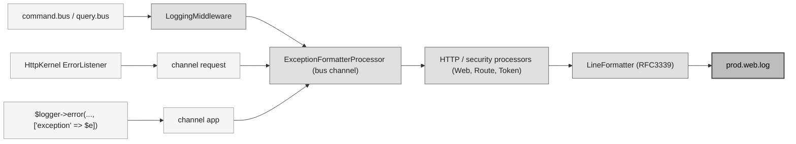
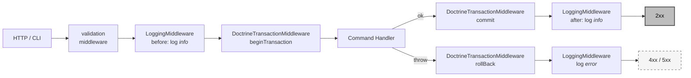

# Pipeline de logging — Messenger bus, Monolog et MON-151077

Ce document décrit le pipeline plateforme qui capture les logs émis par les buses Symfony Messenger (`command.bus`, `query.bus`), enrichit chaque record du contexte HTTP/sécurité et le route vers le fichier `prod.web.log`. Référence : [MON-199096] (migration du middleware côté plateforme), [MON-151077] (layout de fichiers, exclusions de canaux, format RFC3339).

[MON-199096]: https://centreon.atlassian.net/browse/MON-199096
[MON-151077]: https://centreon.atlassian.net/browse/MON-151077

---

## Table des matières

1. [Vue d'ensemble](#1-vue-densemble)
2. [Chaîne de middlewares sur `command.bus`](#2-chaîne-de-middlewares-sur-commandbus)
3. [`DoctrineTransactionMiddleware`](#3-doctrinetransactionmiddleware)
4. [`LoggingMiddleware`](#4-loggingmiddleware)
5. [`ExceptionFormatter` et `ExceptionFormatterProcessor`](#5-exceptionformatter-et-exceptionformatterprocessor)
6. [Processors HTTP / sécurité (Web, Route, Token)](#6-processors-http--sécurité-web-route-token)
7. [Exemple de ligne de log](#7-exemple-de-ligne-de-log)
8. [Périmètre des processors](#8-périmètre-des-processors)
9. [Routage et fichier de sortie](#9-routage-et-fichier-de-sortie)

---

## 1. Vue d'ensemble

Tout dispatch sur les buses Messenger plateforme produit trois enregistrements sur le canal Monolog `bus` :

| Étape | Niveau | Émetteur |
|---|---|---|
| Avant l'exécution du handler | `info` (`Dispatching …`) | `LoggingMiddleware` |
| Retour propre du handler | `info` (`Handled …`) | `LoggingMiddleware` |
| Throw côté handler | `error` (`Failed to handle …`) | `LoggingMiddleware` |

Les exceptions levées **hors** du bus (controllers, ApiPlatform state providers, event listeners, code legacy) suivent un autre chemin (canal `request` ou `app`) mais convergent sur la même shape grâce aux **processors plateforme** :



Tous les composants vivent sous `App\Shared\Infrastructure\…` et sont câblés de manière déclarative dans `config.new/packages/messenger.yaml` (middleware) et `config.new/services/monolog.php` (processors + formatter).

---

## 2. Chaîne de middlewares sur `command.bus`

```
validation → LoggingMiddleware → DoctrineTransactionMiddleware → handler
```

- `validation` (vendor Symfony) — exécute les contraintes Symfony Validator portées par les commands.
- `App\Shared\Infrastructure\Messenger\LoggingMiddleware` — voir [§4](#4-loggingmiddleware).
- `App\Shared\Infrastructure\Messenger\DoctrineTransactionMiddleware` — voir [§3](#3-doctrinetransactionmiddleware).
- handler — `#[AsCommandHandler]`.

L'insertion du `LoggingMiddleware` **avant** le middleware transactionnel est portée par le wiring YAML dans `config.new/packages/messenger.yaml` :

```yaml
command.bus:
    middleware:
        - validation
        - App\Shared\Infrastructure\Messenger\LoggingMiddleware
        - App\Shared\Infrastructure\Messenger\DoctrineTransactionMiddleware
```

Conséquence importante : un échec côté handler est loggé en `error` **une fois le rollback déjà effectué** — le log d'erreur reflète l'état persistant final.



`query.bus` porte la même chaîne **sans** le `DoctrineTransactionMiddleware` — les lectures ne doivent pas ouvrir de transaction.

Les domain events sont dispatchés par le handler **après** le retour de `persist()` mais **avant** le commit du middleware. L'`EventBus` est synchrone in-process, donc un subscriber qui lit le repository voit l'état persisté, et un subscriber qui throw fait rollback la transaction du middleware. Si un subscriber doit attendre le commit du bus parent (dispatch async, appel externe), enveloppez son message avec `DispatchAfterCurrentBusStamp` plutôt que de réintroduire un transactional runner custom.

---

## 3. `DoctrineTransactionMiddleware`

`App\Shared\Infrastructure\Messenger\DoctrineTransactionMiddleware` est le composant qui rend un command **atomique au niveau DB**. Implémentation effective :

```php
public function handle(Envelope $envelope, StackInterface $stack): Envelope
{
    $this->connection->beginTransaction();

    try {
        $envelope = $stack->next()->handle($envelope, $stack);
        $this->connection->commit();

        return $envelope;
    } catch (\Throwable $th) {
        $this->connection->rollBack();

        throw $th;
    }
}
```

Points-clés :

- **Câblé uniquement sur `command.bus`.** Les queries n'en bénéficient pas (pas de transaction sur les lectures pures), et c'est volontaire : les handlers de `query.bus` ne doivent rien écrire.
- **Connexion DBAL.** Le middleware est autowiré sur `doctrine.dbal.default_connection`. Les repositories legacy qui passent par PDO direct (cf. la double connexion Centreon — `ContactRepositoryRDB`, `DbReadAccessGroupRepository`) ne sont **pas couverts** par cette transaction. Toute écriture transactionnelle doit donc passer par DBAL pour committer avec le reste du command.
- **Granularité = 1 command = 1 transaction.** Toutes les mutations qu'un handler émet (à travers plusieurs aggregate repositories ou plusieurs appels sur le même) committent ou rollbackent en bloc. C'est la garantie qui libère les handlers de tout `beginTransaction` / `commit` boilerplate.
- **Sur throw.** Le rollback est complet puis l'exception est relayée au middleware suivant — concrètement le `LoggingMiddleware`, qui logge l'erreur **après** le rollback. Le log reflète donc l'état persistant final, pas l'état "transaction en cours".
- **Pas de nesting.** Câbler un second middleware transactionnel ou rouvrir une transaction depuis le handler **ne crée pas** de transaction imbriquée — DBAL gère via un compteur, mais le `commit` interne est un no-op. Si un chemin d'écriture doit vivre hors du bus (CLI, batch), introduire un port `TransactionalRunnerInterface` à cette frontière plutôt que de réinventer la transaction côté handler.

---

## 4. `LoggingMiddleware`

> [!WARNING]
> **Périmètre du middleware = bus Messenger uniquement.** `LoggingMiddleware` ne logge que les dispatches `command.bus` / `query.bus`. Les exceptions qui surviennent **hors** d'un dispatch (controllers, state providers ApiPlatform, event listeners, code legacy) ne passent **pas** par ce middleware. Elles sont prises en charge par d'autres chemins :
>
> - **Canal `request`** — l'`HttpKernel\EventListener\ErrorListener` de Symfony capture et logge automatiquement toute exception non gérée remontant au noyau HTTP.
> - **Canal `app`** — tout service applicatif qui appelle directement `$logger->error('…', ['exception' => $e])`.
>
> La couverture uniforme est assurée non pas par ce middleware, mais par les **processors taggués sur les trois canaux** (`bus`, `request`, `app`) — voir [§6](#6-processors-http--sécurité-web-route-token). Toute erreur, peu importe son point d'entrée dans Monolog, traverse `ExceptionFormatterProcessor` (shape `{type, message, code, file, line, trace, previous}`) et `WebProcessor` / `RouteProcessor` / `TokenProcessor` (enrichissement HTTP/sécurité).
>
> Angles morts assumés : canaux dédiés en `!exclude` du `web_finger_crossed` (`event`, `doctrine`, `console`, `deprecation`, `authentication`, `token`, `password`, `plugin-pack-manager`, `upgrade`), canal `console` en CLI, et fatales PHP avant boot du kernel (parse error, OOM).

Le middleware émet un enregistrement sur le canal Monolog `bus` à chaque dispatch :

| Évènement | Niveau | Message | Contexte |
|-----------|--------|---------|----------|
| Avant `next()` | `info`  | `Dispatching {bus_type} {handler_message}` | `dispatch_id`, `bus_type`, `handler_message`, `payload` |
| Retour propre  | `info`  | `Handled {bus_type} {handler_message}`     | `dispatch_id`, `bus_type`, `handler_message`, `handlers`, `duration_ms`, `payload` |
| Throw          | `error` | `Failed to handle {bus_type} {handler_message}` | `dispatch_id`, `bus_type`, `handler_message`, `duration_ms`, `payload`, `exception` |

- **`dispatch_id`** : id 16 caractères hex généré par dispatch (`bin2hex(random_bytes(8))`, 64 bits d'entropie). Identique sur les trois émissions d'un même `handle()`, différent d'un dispatch à l'autre. Permet de pair-matcher Dispatching ↔ Handled / Failed dans la recherche logs quand le canal `bus` est saturé de traffic d'autres dispatches interleavés.
- **`bus_type`** : `command`, `query`, ou le nom brut du bus si non reconnu (résolution sur le `BusNameStamp`).
- **`handler_message`** : FQCN du **message** dispatché (la classe de la Command / Query / Event). Le nom évite la collision avec le `%message%` Monolog (le message human-readable du log) et avec `context.exception.message` en cas d'erreur — un seul `message` ambigu dans le record posait un risque de confusion lecteur et de parser.
- **`handlers`** (Handled seulement) : liste des `HandledStamp::getHandlerName()` produits par les handlers ayant tourné. Sur un command/query bus single-handler, la liste a un seul élément ; sur un event bus avec plusieurs subscribers, elle en a plusieurs. Liste vide si aucun handler n'a tourné (court-circuit). Distinct du champ `handler_message` qui nomme la classe du **message** dispatché.
- **`duration_ms`** (Handled et Failed) : durée du dispatch en millisecondes, mesurée avec `hrtime(true)` (horloge monotone, immunisée des sauts NTP / DST). Arrondie à 3 décimales. Pas présent sur le log Dispatching qui sert de référence t0.
- **`payload`** : le message normalisé via `NormalizerInterface`, sanitisé en place — clés contenant `password`, `token`, `secret`, `api_key`, `authorization`, `credential` masquées en `***`, profondeur max 3 niveaux, valeurs string tronquées à 1024 caractères. Si la normalisation échoue ou ne produit pas un tableau, le payload retombe sur `['__class' => $message::class]`. Defense-in-depth pour les valeurs qui restent un objet après normalisation (pas de normalizer dédié pour ce type) : `\BackedEnum` rendu via `->value`, `\UnitEnum` via `->name`, `\DateTimeInterface` via `format(ATOM)`, `\Stringable` via cast string + troncature, et tout autre objet plain rendu en placeholder `{ClassName}` — pas de cast `(array)` sur les objets, pour éviter d'exposer leurs propriétés privées.

  **Masquage volontairement permissif.** Les mots-clés sensibles sont matchés en `str_contains` après `mb_strtolower`, pas en match exact. Conséquence : tout nom de champ qui *contient* un mot-clé est masqué, y compris quand le champ lui-même n'est pas sensible. Exemples de faux positifs :
  - `password_changed_at` (timestamp) → masqué (contient `password`)
  - `oauth_authorization_url` (URL publique) → masqué (contient `authorization`)
  - `tokenize_input` (flag bool) → masqué (contient `token`)
  - `credential_check_id` (id de référence) → masqué (contient `credential`)

  Ce default *« sur-masquer plutôt que sous-masquer »* est assumé : on préfère perdre un peu d'info debug que de rater un vrai secret porté par une variante non listée (ex. `passwords_v2`, `customer_token_id`). Si le bruit devient bloquant pour une Command donnée, la solution propre est d'introduire des attributs PHP `#[Sensitive]` / `#[NotSensitive]` côté Command et de les inspecter dans `isSensitiveKey()` — pas d'élargir la liste de mots-clés ni de passer en match exact, ce qui ouvrirait la porte aux variantes oubliées. Suivi sous [MON-199097](https://centreon.atlassian.net/browse/MON-199097).
- **`exception`** : produit par `ExceptionFormatter::format()` (voir [§5](#5-exceptionformatter-et-exceptionformatterprocessor)).

---

## 5. `ExceptionFormatter` et `ExceptionFormatterProcessor`

### `ExceptionFormatter`

`App\Shared\Infrastructure\Logging\ExceptionFormatter` est un utilitaire `abstract readonly` sans dépendance qui transforme un `\Throwable` en `array<string, mixed>` loggable.

Forme retournée :

```php
[
    'type'     => DomainException::class,
    'message'  => 'top',
    'code'     => 0,
    'file'     => '/.../Foo.php',
    'line'     => 42,
    'trace'    => ['Foo::bar() at /.../Foo.php:42', /* ... */, '… 7 frames omitted'], // 15 frames max + omission marker
    'previous' => [
        [
            'type' => RuntimeException::class,
            'message' => 'mid',
            'code' => 0, 'file' => '...', 'line' => 12, 'trace' => [/* ... */],
            'previous' => [], // toujours vide sur les feuilles — pas de récursion dans le format
        ],
        [
            'type' => LogicException::class,
            'message' => 'root cause',
            'code' => 0, 'file' => '...', 'line' => 5, 'trace' => [/* ... */],
            'previous' => [],
        ],
    ],
]
```

- `message` est tronqué à 1024 caractères avec le suffixe `…[truncated]` au-delà — même plafond que `MAX_VALUE_LENGTH` côté sanitisation du payload. Évite qu'une `PDOException` portant un long fragment SQL avec ses paramètres ne fasse exploser la largeur d'une ligne de log.
- `trace` est tronquée à 15 frames, chaque frame formatée en `Class::method() at file:line`. Si la stack originale dépasse cette limite, une dernière entrée `… N frames omitted` indique combien de frames ont été coupées (utile en debug pour savoir si on a perdu le call site applicatif sous des couches Symfony / vendor).
- **Shape uniforme** : la racine et chaque entrée de `previous` portent les **mêmes sept clés** (`type, message, code, file, line, trace, previous`). Sur une feuille, `previous` est **toujours `[]`** — on ne récurse jamais le format. Un consommateur (Kibana, parser custom) peut donc itérer l'arbre avec une seule shape et détecter les feuilles sur `previous === []`, sans branchement de schéma.
- `previous` est aplatie en liste (cause directe en premier, racine en dernier), cappée à 20 entrées avec un marker `@truncated` de fin si la chaîne dépasse.

Réutilisable depuis n'importe quel point d'entrée d'erreur (event listener, API handler, Symfony exception listener…) sans repasser par le middleware.

### `ExceptionFormatterProcessor`

`App\Shared\Infrastructure\Logging\ExceptionFormatterProcessor` est un processor Monolog (`#[AsMonologProcessor(channel: 'bus')]`, également câblé sur `request` et `app` via `config.new/services/monolog.php`) qui détecte **défensivement** un `Throwable` dans la clé `context.exception` et lui applique `ExceptionFormatter::format()`. Idempotent sur les records où la clé `exception` est déjà un array (cas du `LoggingMiddleware` qui pré-formate) ou absente.

Ce processor garantit une **shape d'exception uniforme** sur les trois canaux (`bus`, `request`, `app`), peu importe l'émetteur du log :

- Canal `bus` — exceptions déjà pré-formatées par `LoggingMiddleware`, processor no-op.
- Canal `request` — records émis par l'`ErrorListener` Symfony avec un `Throwable` brut dans `exception`. Le processor formatte.
- Canal `app` — records émis par des `$logger->error('...', ['exception' => $e])` ad-hoc. Idem.

---

## 6. Processors HTTP / sécurité (Web, Route, Token)

`Symfony\Bridge\Monolog\Processor\WebProcessor`, `RouteProcessor` et `TokenProcessor` sont enregistrés dans `config.new/services/monolog.php` et taggués `monolog.processor` sur les **mêmes trois canaux** que `ExceptionFormatterProcessor` (`bus`, `request`, `app`) — symétrie volontaire pour que les quatre processors partagent un seul scope.

| Processor | Ajoute à `extra` |
|-----------|------------------|
| `WebProcessor` | `url`, `ip`, `http_method`, `server`, `referrer` |
| `RouteProcessor` | `controller`, `route`, `route_params` |
| `TokenProcessor` | `token` (`authenticated`, `roles`, `user_identifier`) |

En contexte CLI (cron, console command, batch), ces processors sont attachés mais produisent un `extra` vide ou null sur les clés sans pertinence — c'est le comportement attendu, pas un bug.

---

## 7. Exemple de ligne de log

Sortie réelle produite par la chaîne complète sur le canal `bus` (`LoggingMiddleware` + `ExceptionFormatterProcessor` + `WebProcessor` + `RouteProcessor` + `TokenProcessor`, sérialisé par le `LineFormatter` avec timestamp RFC3339), pour le dispatch d'un command `UpdateBusinessActivityTreeCommand` (le module BAM sert ici d'exemple concret du flow).

Format `LineFormatter` en sortie : `[%datetime%] %channel%.%level_name%: %message% %context% %extra%` (un record = une ligne dans `prod.web.log`). Le contexte et l'extra sont sérialisés inline en JSON ; ci-dessous ils sont coupés sur plusieurs lignes pour la lisibilité.

### Cas nominal (`info`)

Ligne brute :

```
[2026-05-06T09:44:19+00:00] bus.INFO: Dispatching command App\Module\Bam\MonitoringConfiguration\Application\Command\BusinessActivityTree\UpdateBusinessActivityTreeCommand {"dispatch_id":"3f8a2c1b9e5d4670","bus_type":"command","handler_message":"App\\Module\\Bam\\…\\UpdateBusinessActivityTreeCommand","payload":{"rootBaId":42,"businessActivities":[{"id":100,"name":"Web Frontend","parentId":42,"warningThreshold":75.0}],"indicatorsToAdd":[{"hostId":12,"serviceId":34,"baId":100}],"token":"***","authorization_header":"***"}} {"token":{"authenticated":true,"roles":["ROLE_ADMIN","ROLE_USER"],"user_identifier":"admin"},"requests":[{"controller":"App\\Module\\Bam\\…\\UpdateBusinessActivityTreeProcessor::__invoke","route":"bam_business_activity_tree_patch","route_params":{"rootId":"42"}}],"url":"/api/latest/configuration/business-activities/42/tree","ip":"10.10.0.42","http_method":"PATCH","server":"centreon.example.com","referrer":null}
```

`context` (produit par `LoggingMiddleware`) :

```json
{
  "dispatch_id": "3f8a2c1b9e5d4670",
  "bus_type": "command",
  "handler_message": "App\\Module\\Bam\\…\\UpdateBusinessActivityTreeCommand",
  "payload": {
    "rootBaId": 42,
    "businessActivities": [
      {"id": 100, "name": "Web Frontend", "parentId": 42, "warningThreshold": 75.0}
    ],
    "indicatorsToAdd": [
      {"hostId": 12, "serviceId": 34, "baId": 100}
    ],
    "token": "***",
    "authorization_header": "***"
  }
}
```

Sur le log `Handled` correspondant (succès), le contexte porte en plus `handlers: ["App\\Module\\Bam\\…\\UpdateBusinessActivityTreeCommandHandler::__invoke"]` (single-handler côté command bus), `duration_ms: 42.187` (3 décimales) et reprend exactement le même `dispatch_id`.

Noter que `token` et `authorization_header` sont déjà masqués par la sanitisation du middleware — pas par les processors.

`extra` (produit par les 3 processors HTTP/sécurité) :

```json
{
  "token": {
    "authenticated": true,
    "roles": ["ROLE_ADMIN", "ROLE_USER"],
    "user_identifier": "admin"
  },
  "requests": [
    {
      "controller":   "App\\Module\\Bam\\…\\UpdateBusinessActivityTreeProcessor::__invoke",
      "route":        "bam_business_activity_tree_patch",
      "route_params": {"rootId": "42"}
    }
  ],
  "url":         "/api/latest/configuration/business-activities/42/tree",
  "ip":          "10.10.0.42",
  "http_method": "PATCH",
  "server":      "centreon.example.com",
  "referrer":    null
}
```

- `token` ← `TokenProcessor`
- `requests[0]` ← `RouteProcessor` (la clé est un tableau parce que le processor empile une entrée par sous-requête HttpKernel ; en cas nominal il y en a une)
- `url` / `ip` / `http_method` / `server` / `referrer` ← `WebProcessor`

### Cas erreur (`error`)

Le `context.exception` est ici produit par `ExceptionFormatter::format()` directement dans `LoggingMiddleware`. L'`ExceptionFormatterProcessor` est no-op sur ce record (clé déjà array) — il aurait pris le relais si l'exception arrivait brute sur `request` ou `app` (Symfony `ErrorListener`, ou un `$logger->error('…', ['exception' => $e])` ad-hoc).

```json
{
  "dispatch_id": "3f8a2c1b9e5d4670",
  "bus_type": "command",
  "handler_message": "App\\Module\\Bam\\…\\UpdateBusinessActivityTreeCommand",
  "duration_ms": 42.187,
  "payload": { /* idem cas nominal */ },
  "exception": {
    "type":    "DomainException",
    "message": "UpdateBusinessActivityTree aggregate refused mutation",
    "code":    1001,
    "file":    "/.../UpdateBusinessActivityTreeCommandHandler.php",
    "line":    87,
    "trace": [
      "App\\Module\\Bam\\…\\UpdateBusinessActivityTreeCommandHandler->__invoke() at /.../UpdateBusinessActivityTreeCommandHandler.php:87",
      "Symfony\\Component\\Messenger\\Handler\\HandlersLocator->{closure}() at /.../HandleMessageMiddleware.php:152"
    ],
    "previous": [
      {
        "type":    "RuntimeException",
        "message": "failed to load BA #100 children",
        "code":    0,
        "file":    "/.../DbReadBusinessActivityTreeRepository.php",
        "line":    214,
        "trace":   [ "…" ],
        "previous": []
      }
    ]
  }
}
```

Points à retenir :

- `previous` est **plat** (la cause directe en premier, la racine en dernier) — pas de récursion, donc itérable avec une seule shape.
- Sur chaque feuille, `previous === []` (jamais omis, jamais récursif).
- Le record d'erreur arrive sur `bus.ERROR` **après** le rollback du `DoctrineTransactionMiddleware` — l'état persistant est définitif au moment où le log est émis.

---

## 8. Périmètre des processors

Les quatre processors (`ExceptionFormatterProcessor`, `WebProcessor`, `RouteProcessor`, `TokenProcessor`) sont câblés en **scope canal** (`bus`, `request`, `app`) et **pas en scope handler** (`web_file`).

### Logs hors `bus|request|app`

- Les logs émis sur des canaux **capturés par le filtre exclusif mais hors `bus|request|app`** (typiquement `main` et `security`, les canaux par défaut Symfony et SecurityBundle) arrivent quand même dans `prod.web.log`.
- Mais ils **ne portent pas** le contexte HTTP/sécurité (`url`, `route`, `token`, …) ni le reformatage `ExceptionFormatter` — les processors ne s'appliquent qu'aux trois canaux explicites.
- En pratique, les call sites sensibles qui loggent une exception passent déjà par `Core\Common\Infrastructure\ExceptionLogger\ExceptionLogger` (qui pré-formate avant de pousser au logger) — l'impact réel est limité.

---

## 9. Routage et fichier de sortie

L'ensemble du pipeline (middleware + processors + processors HTTP) converge vers **un seul handler Monolog** écrivant dans **un seul fichier**. Configuration dans `config.new/packages/monolog.yaml` (extrait `when@prod`) :

```yaml
handlers:
    web_finger_crossed:
        type: fingers_crossed
        action_level: error
        buffer_size: 50
        stop_buffering: true
        handler: web_file
        channels:
            - "!event"
            - "!doctrine"
            - "!console"
            - "!deprecation"
            - "!authentication"
            - "!token"
            - "!password"
            - "!plugin-pack-manager"
            - "!upgrade"
        bubble: false
        priority: 255
    web_file:
        type: stream
        path: "%kernel.logs_dir%/%kernel.environment%.web.log"
        level: debug
        formatter: monolog.formatter.line
        date_format: !php/const DateTimeInterface::RFC3339
```

**RFC3339 piloté au niveau du service.** `config.new/services/monolog.php` redéfinit le service `monolog.formatter.line` avec `dateFormat: RFC3339` :

```php
$services->set('monolog.formatter.line', LineFormatter::class)
    ->arg('$dateFormat', DateTimeInterface::RFC3339);
```

Conséquence : tous les handlers utilisant `monolog.formatter.line` (centreon-web + tout module installé sur le kernel new) émettent leur timestamp en RFC3339 sans avoir à écrire `date_format:` sur chaque handler.

**Pourquoi pas `date_format:` au niveau handler sur `rotating_file` ?** Sur ce type de handler, la clé `date_format:` du Symfony Monolog Bundle est passée au **constructeur de `RotatingFileHandler`** où elle configure le suffixe de **date du nom de fichier** (`Y-m-d` par défaut). Mettre RFC3339 ici jette une `InvalidArgumentException` au boot. Pour les autres types (`stream`, `console`…) la clé s'applique bien au formatter — mais on choisit l'approche service unique pour rester DRY.

**Filtre exclusif (alignement MON-151077).** Plutôt qu'une whitelist `[bus, request, app]`, on utilise une blacklist de canaux qui ont leur propre fichier ou qui sont du bruit. Tout le reste — `bus`, `request`, `app`, mais aussi `main` (canal par défaut Symfony), `security`, `http_client`, etc. — atterrit dans `prod.web.log`.

| Canal exclu | Raison |
|-------------|--------|
| `event`, `doctrine`, `console` | Bruit Symfony / DBAL interne — non désiré dans `prod.web.log`. |
| `deprecation` | MON-151077 → fichier dédié `prod.deprecations.log`. |
| `authentication` | MON-151077 → fusionné dans `prod.access.log` côté centreon-web. |
| `token` | MON-151077 → fichier dédié `prod.token.log`. |
| `password`, `plugin-pack-manager`, `upgrade` | MON-151077 → fichiers dédiés. Pas des canaux Monolog au sens strict aujourd'hui (écrits directement par le code legacy `CentreonLog`), mais listés en anticipation d'une migration future vers Monolog. |

| Propriété | Effet |
|-----------|--------|
| `type: fingers_crossed` + `action_level: error` | En succès, les records `INFO`/`DEBUG` sont bufferisés en RAM et jetés à la fin de la requête — zéro I/O disque. Au premier `ERROR`, l'intégralité du buffer plus le record déclencheur sont flushés au handler imbriqué. |
| `stop_buffering: true` | Après le flush déclencheur, le handler arrête de bufferiser — la suite de la requête écrit directement. |
| `buffer_size: 50` | Plafond mémoire du buffer. Au-delà, le `FingersCrossedHandler` **drop les records les plus anciens**. 50 est la valeur cible MON-151077. |
| `bubble: false` | **Le record s'arrête après notre handler.** Conséquence : les exceptions HTTP capturées par l'`ErrorListener` Symfony (canal `request`) **ne remontent plus** au handler `main` de l'host (`var/log/{env}.log`). Elles vivent uniquement dans `var/log/{env}.web.log`. |
| `priority: 255` | Notre handler est exécuté en premier dans le stack Monolog du canal — combiné à `bubble: false`, garantit l'isolation effective. |
| `path: ...{env}.web.log` | En prod, fichier figé `prod.web.log` (la rotation est déléguée à `logrotate` sur les hosts de prod, cf. `logrotate/centreon`). En dev, le handler est `rotating_file` avec suffixe daté. |
| `formatter: monolog.formatter.line` | Service standard Symfony Monolog Bundle, redéfini dans `monolog.php` avec `dateFormat: RFC3339`. Timestamp format imposé par MON-151077 (par ex. `2025-09-08T15:38:41+02:00`). |

### Rotation des fichiers

En production, les fichiers `prod.*.log` sont rotés par **logrotate** (config `centreon/logrotate/centreon`, déployée en `/etc/logrotate.d/centreon`). Les fichiers MON-151077 listés :

- `prod.web.log` (catch-all)
- `prod.deprecations.log`
- `prod.access.log` (authentication)
- `prod.token.log`
- `prod.password.log`
- `prod.upgrade.log`
- `prod.plugin-pack-manager.log`

Rétention par défaut : `weekly` × `rotate 52` (1 an), avec `compress` + `delaycompress` + `copytruncate`.

En développement (`when@dev` dans `monolog.yaml`), les handlers utilisent `rotating_file` directement (suffixe daté `Y-m-d`, rétention `max_files: 14`) — pas besoin de logrotate.
