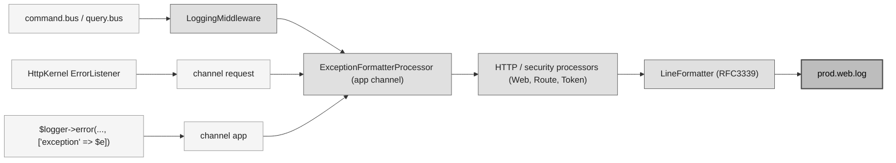
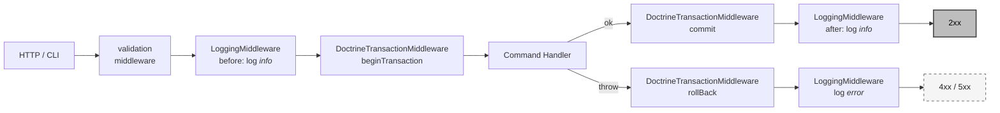

# Logging pipeline — Messenger bus and Monolog

This document describes the platform pipeline that captures logs emitted by the Symfony Messenger buses (`command.bus`, `query.bus`), enriches each record with HTTP / security context and routes it to `prod.web.log`.

---

## Table of contents

1. [Overview](#1-overview)
2. [Middleware chain on `command.bus`](#2-middleware-chain-on-commandbus)
3. [`DoctrineTransactionMiddleware`](#3-doctrinetransactionmiddleware)
4. [`LoggingMiddleware`](#4-loggingmiddleware)
5. [`ExceptionFormatter` and `ExceptionFormatterProcessor`](#5-exceptionformatter-and-exceptionformatterprocessor)
6. [HTTP / security processors (Web, Route, Token)](#6-http--security-processors-web-route-token)
7. [Log line example](#7-log-line-example)
8. [Processor scope](#8-processor-scope)
9. [Routing and output file](#9-routing-and-output-file)
10. [Masking sensitive fields with `#[Sensitive]`](#10-masking-sensitive-fields-with-sensitive)

---

## 1. Overview

Every dispatch on the platform Messenger buses produces three records on the Monolog `app` channel (Symfony default):

| Stage | Level | Emitter |
|---|---|---|
| Before the handler runs | `info` (`Dispatching …`) | `LoggingMiddleware` |
| Handler clean return | `info` (`Handled …`) | `LoggingMiddleware` |
| Handler throw | `warning` (domain rejection → 4xx) / `critical` (unexpected → 5xx) (`Failed to handle …`) | `LoggingMiddleware` |

Exceptions thrown **outside** the bus (controllers, ApiPlatform state providers, event listeners, legacy code) take a different path (typically the `request` or `app` channel) but converge on the same shape thanks to the **platform processors** (registered globally, see [§7](#7-cross-channel-correlation-uidprocessor)):



Every component lives under `App\Shared\Infrastructure\…` and is wired declaratively in `config.new/packages/messenger.yaml` (middleware) and `config.new/services/monolog.php` (processors + formatter).

---

## 2. Middleware chain on `command.bus`

```
validation → LoggingMiddleware → DoctrineTransactionMiddleware → handler
```

- `validation` (Symfony vendor) — runs the Symfony Validator constraints carried by the commands.
- `App\Shared\Infrastructure\Messenger\LoggingMiddleware` — see [§4](#4-loggingmiddleware).
- `App\Shared\Infrastructure\Messenger\DoctrineTransactionMiddleware` — see [§3](#3-doctrinetransactionmiddleware).
- handler — `#[AsCommandHandler]`.

The insertion of `LoggingMiddleware` **before** the transactional middleware is carried by the YAML wiring in `config.new/packages/messenger.yaml`:

```yaml
command.bus:
    middleware:
        - validation
        - App\Shared\Infrastructure\Messenger\LoggingMiddleware
        - App\Shared\Infrastructure\Messenger\DoctrineTransactionMiddleware
```

Important consequence: a handler-side failure is logged **after** the rollback has already happened — the failure log reflects the final persistent state.



`query.bus` carries the same chain **without** the `DoctrineTransactionMiddleware` — reads must not open a transaction.

Domain events are dispatched by the handler **after** `persist()` returns but **before** the middleware commit. The `EventBus` is synchronous in-process, so a subscriber that reads the repository sees the persisted state, and a subscriber that throws causes the middleware transaction to be rolled back. If a subscriber must wait for the parent bus commit (async dispatch, external call), wrap its message with `DispatchAfterCurrentBusStamp` rather than reintroducing a custom transactional runner.

---

## 3. `DoctrineTransactionMiddleware`

`App\Shared\Infrastructure\Messenger\DoctrineTransactionMiddleware` is the component that makes a command **atomic at the DB level**. Effective implementation:

```php
public function handle(Envelope $envelope, StackInterface $stack): Envelope
{
    $this->connection->beginTransaction();

    try {
        $envelope = $stack->next()->handle($envelope, $stack);
        $this->connection->commit();

        return $envelope;
    } catch (\Throwable $th) {
        $this->connection->rollBack();

        throw $th;
    }
}
```

Key points:

- **Wired on `command.bus` only.** Queries do not benefit from it (no transaction on pure reads), and this is by design: `query.bus` handlers must not write anything.
- **DBAL connection.** The middleware is autowired on `doctrine.dbal.default_connection`. Legacy repositories that go through direct PDO (cf. the dual Centreon connection — `ContactRepositoryRDB`, `DbReadAccessGroupRepository`) are **not covered** by this transaction. Any transactional write must therefore go through DBAL to commit alongside the rest of the command.
- **Granularity = 1 command = 1 transaction.** All mutations emitted by a handler (through several aggregate repositories or several calls on the same one) commit or roll back as a block. This is the guarantee that frees handlers from any `beginTransaction` / `commit` boilerplate.
- **On throw.** The rollback is complete then the exception is propagated to the next middleware — concretely the `LoggingMiddleware`, which logs the error **after** the rollback. The log therefore reflects the final persistent state, not the "transaction in progress" state.
- **No nesting.** Wiring a second transactional middleware or reopening a transaction from the handler does **not** create a nested transaction — DBAL handles this with a counter, but the inner `commit` is a no-op. If a write path must live outside the bus (CLI, batch), introduce a `TransactionalRunnerInterface` port at that boundary rather than reinventing the transaction on the handler side.

---

## 4. `LoggingMiddleware`

> [!WARNING]
> **Middleware scope = Messenger bus only.** `LoggingMiddleware` only logs `command.bus` / `query.bus` dispatches. Exceptions raised **outside** a dispatch (controllers, ApiPlatform state providers, event listeners, legacy code) do **not** go through this middleware. They are handled by other paths:
>
> - **`request` channel** — Symfony's `HttpKernel\EventListener\ErrorListener` automatically captures and logs any unhandled exception bubbling up to the HTTP kernel.
> - **`app` channel** — any application service that calls `$logger->error('…', ['exception' => $e])` directly.
>
> Uniform coverage is guaranteed not by this middleware but by the **processors registered globally on every channel** — see [§6](#6-http--security-processors-web-route-token). Any error, regardless of its entry point into Monolog, traverses `ExceptionFormatterProcessor` (shape `{exceptions: [{type, message, code, file, line, trace}, …]}`) and `WebProcessor` / `RouteProcessor` / `TokenProcessor` (HTTP / security enrichment).
>
> Assumed blind spots: dedicated channels in the `!exclude` list of `web_finger_crossed` (`event`, `doctrine`, `console`, `deprecation`, `authentication`, `token`, `password`, `plugin-pack-manager`, `upgrade`), the `console` channel in CLI, and PHP fatals before kernel boot (parse error, OOM).

The middleware emits a record on the Monolog `app` channel (Symfony default) for every dispatch:

| Event | Level | Message | Context |
|-------|-------|---------|---------|
| Before `next()` | `info`  | `Dispatching {bus_type} {handler_message}` | `dispatch_id`, `bus_type`, `handler_message`, `payload` |
| Clean return  | `info`  | `Handled {bus_type} {handler_message}`     | `dispatch_id`, `bus_type`, `handler_message`, `handlers`, `duration_ms` |
| Throw          | `warning` / `critical` | `Failed to handle {bus_type} {handler_message}` | `dispatch_id`, `bus_type`, `handler_message`, `duration_ms`, `payload`, `exception` |

- **`dispatch_id`**: a non-cryptographic, time-based correlation id generated per dispatch (`uniqid('', true)`) — a log correlator, not a secret, so no CSPRNG is needed. Identical on the three emits of a single `handle()`, different from one dispatch to the next. Lets you pair-match Dispatching ↔ Handled / Failed in log search when the `app` channel is saturated with traffic from other interleaved dispatches.
- **`bus_type`**: raw bus name read from the envelope's `BusNameStamp` (`command.bus`, `query.bus`, `event.bus`, …), or `unknown` if no stamp is attached.
- **`handler_message`**: FQCN of the **message** dispatched (the Command / Query / Event class). The name avoids collision with Monolog's `%message%` (the human-readable log message) and with `context.exception.message` on error — a single ambiguous `message` in the record carried a risk of reader and parser confusion.
- **`handlers`** (Handled only): list of `HandledStamp::getHandlerName()` produced by the handlers that ran. On a single-handler command/query bus, the list has one element; on an event bus with several subscribers, it has several. Empty list if no handler ran (short-circuit). Distinct from the `handler_message` field, which names the **message** class dispatched.
- **`duration_ms`** (Handled and Failed): dispatch duration in milliseconds, measured with `hrtime(true)` (monotonic clock, immune to NTP / DST jumps). Rounded to 3 decimals. Not present on the Dispatching log, which serves as the t0 reference.
- **`payload`**: the message turned into a log-safe array by `App\Shared\Infrastructure\Logging\LogPayloadNormalizer` — a dedicated service that wraps the platform `NormalizerInterface` and applies the constraints needed for a log line: keys containing `password`, `token`, `secret`, `api_key`, `authorization`, `credential` masked as `***`, string values truncated at 1024 characters. No runtime depth cap is enforced: the input is always a strongly-typed Messenger message whose class graph already bounds the depth statically. If normalisation fails or does not produce an array, the payload falls back to `['__class' => $message::class]` and a `warning` is emitted on the `app` channel. Defense-in-depth for values that remain an object after normalisation (no dedicated normaliser for that type): `\BackedEnum` rendered via `->value`, `\UnitEnum` via `->name`, `\DateTimeInterface` via `format(ATOM)`, `\Stringable` via string cast + truncation, and any other plain object rendered as a placeholder `{ClassName}` — no `(array)` cast on objects, to avoid exposing their private properties.
- **Failure level**: a `\InvalidArgumentException` (Centreon's `AssertionException` extends it — a value-object / domain rejection that maps to a 4xx) is logged at `warning`; any other throwable is an unexpected server-side failure (DB down, OOM, bug → 5xx) and is logged at `critical`. This mirrors the `CRITICAL`-vs-`WARNING` split of `LegacyHttpExceptionListener`, so alerting can ignore expected client errors without muting real incidents.

  **Intentionally permissive masking.** Sensitive keywords are matched with `str_contains` after `mb_strtolower`, not exact match. Consequence: any field name that *contains* a keyword is masked, including when the field itself is not sensitive. False-positive examples:
  - `password_changed_at` (timestamp) → masked (contains `password`)
  - `oauth_authorization_url` (public URL) → masked (contains `authorization`)
  - `tokenize_input` (bool flag) → masked (contains `token`)
  - `credential_check_id` (reference id) → masked (contains `credential`)

  This *"over-mask rather than under-mask"* default is intentional: we'd rather lose a bit of debug info than miss a real secret carried by an unlisted variant (e.g. `passwords_v2`, `customer_token_id`). For the opposite cases — a real secret carrying an unlisted name, or keyword noise on a given Command — the explicit, type-safe complement is the `#[Sensitive]` attribute (see [§10](#10-masking-sensitive-fields-with-sensitive)). It is preferred over broadening the keyword list or switching to exact match, which would open the door to forgotten variants.
- **`exception`**: produced by `ExceptionFormatter::format()` (see [§5](#5-exceptionformatter-and-exceptionformatterprocessor)).

---

## 5. `ExceptionFormatter` and `ExceptionFormatterProcessor`

### `ExceptionFormatter`

`App\Shared\Infrastructure\Logging\ExceptionFormatter` is an `abstract readonly` utility with no dependency that turns a `\Throwable` into a loggable `array<string, mixed>`.

Returned shape:

```php
[
    'exceptions' => [
        [
            'type'    => DomainException::class,
            'message' => 'top',
            'code'    => 0,
            'file'    => '/.../Foo.php',
            'line'    => 42,
            'trace'   => ['Foo::bar() at /.../Foo.php:42', /* ... */, '… 7 frames omitted'], // 15 frames max + omission marker
        ],
        [
            'type'    => RuntimeException::class,
            'message' => 'mid',
            'code'    => 0, 'file' => '...', 'line' => 12,
            'trace'   => [/* ... */],
        ],
        [
            'type'    => LogicException::class,
            'message' => 'root cause',
            'code'    => 0, 'file' => '...', 'line' => 5,
            'trace'   => [/* ... */],
        ],
    ],
]
```

- The root exception is the first entry; every `previous` cause that follows is appended in order. The chain is **flat** — no nesting, no recursion.
- `message` is truncated at 1024 characters with the `…[truncated]` suffix beyond that — same cap as `MAX_VALUE_LENGTH` on the payload sanitisation side. Prevents a `PDOException` carrying a long SQL fragment with its parameters from blowing up the width of a log line.
- `trace` is truncated at 15 frames, each frame formatted as `Class::method() at file:line`. If the original stack exceeds this limit, a final `… N frames omitted` entry indicates how many frames were cut (useful in debug to know whether the application call site was lost under Symfony / vendor layers).
- **Uniform shape**: every entry — root, intermediates and the truncation marker — carries the **same six keys** (`type, message, code, file, line, trace`). A consumer (Kibana, custom parser) can iterate `exceptions` with a single shape and no schema branching.
- The chain is capped at 20 entries; beyond that a trailing entry of type `@truncated` (with `code: 0`, empty `trace`, a message stating the cap) signals the cut without re-walking the chain.

Reusable from any error entry point (event listener, API handler, Symfony exception listener…) without going back through the middleware.

### `ExceptionFormatterProcessor`

`App\Shared\Infrastructure\Logging\ExceptionFormatterProcessor` is a Monolog processor registered **globally** (`#[AsMonologProcessor]` without `channel:`) that **defensively** detects a `Throwable` in the `context.exception` slot and applies `ExceptionFormatter::format()` to it. Idempotent on records where the `exception` key is already an array (the `LoggingMiddleware` pre-format case) or absent.

Being global, it guarantees a **uniform exception shape** on every channel (catch-all and dedicated alike), regardless of the log emitter:

- `app` channel — bus dispatch failures already pre-formatted by `LoggingMiddleware`, processor no-op.
- `request` channel — records emitted by Symfony's `ErrorListener` with a raw `Throwable` in `exception`. The processor formats them.
- Any other channel — ad-hoc `$logger->error('…', ['exception' => $e])` calls anywhere in the codebase. Same deal.

---

## 6. HTTP / security processors (Web, Route, Token)

`Symfony\Bridge\Monolog\Processor\WebProcessor`, `RouteProcessor` and `TokenProcessor` are registered in `config.new/services/monolog.php` and tagged `monolog.processor` **globally** — same scope as `ExceptionFormatterProcessor` and `UidProcessor`, so every channel carries the same enriched shape.

| Processor | Adds to `extra` |
|-----------|-----------------|
| `WebProcessor` | `url`, `ip`, `http_method`, `server`, `referrer` |
| `RouteProcessor` | `controller`, `route`, `route_params` |
| `TokenProcessor` | `token` (`authenticated`, `roles`, `user_identifier`) |

> [!NOTE]
> **Context is now passed flat.** The legacy logging helpers (`Centreon\Domain\Log\LoggerTrait`, `CentreonLog`) used to wrap every record's context into `{custom, exception, default: {request_infos: {uri, http_method, server}}}` via a per-call `normalizeContext()`. That wrapper is gone: callers' context is forwarded as-is to the logger. The request metadata it used to inject by hand is now provided globally by `WebProcessor` under `extra.url` / `extra.http_method` / `extra.server` (plus `ip`, `referrer`), so it is no longer duplicated per call. Any external consumer that parsed the old nested `context.default.request_infos.*` shape must read `extra.*` instead.

### `UidProcessor` — cross-channel correlation

`Monolog\Processor\UidProcessor` is registered in `config.new/services/monolog.php` **with no channel tag** — it therefore applies to **every logger** (request, app, deprecation, authentication, token, password, upgrade, plugin-pack-manager). It generates **a single 7-character hex id per process** and stamps it under `extra.uid` on every record:

```php
$services->set('monolog.processor.uid', UidProcessor::class)
    ->tag('monolog.processor');   // no channel ⇒ every logger
```

**Why a platform-wide UID when we already have `dispatch_id`?**

| Field | Scope | Emitter | Use case |
|---|---|---|---|
| `extra.uid` | whole HTTP / CLI request | `UidProcessor` (Monolog) | Reconstruct every record produced by a request, **across all channels** (catch-all + dedicated files) |
| `context.dispatch_id` | a single bus dispatch | `LoggingMiddleware` | Pair-match Dispatching ↔ Handled / Failed for a single `handle()`, on the records emitted by the middleware |

Concretely, on a single HTTP request that dispatches two commands and also lands in `prod.token.log`:

```
prod.web.log
[…] app.INFO  Dispatching cmd-A {"dispatch_id":"3f8a2c1b9e5d4670",…} {"uid":"89796c2",…}
[…] app.INFO  Handled cmd-A    {"dispatch_id":"3f8a2c1b9e5d4670",…} {"uid":"89796c2",…}
[…] app.INFO  Dispatching cmd-B {"dispatch_id":"a2bf91c45ad7e003",…} {"uid":"89796c2",…}
[…] app.INFO  Handled cmd-B    {"dispatch_id":"a2bf91c45ad7e003",…} {"uid":"89796c2",…}
[…] request.INFO Matched route …                                    {"uid":"89796c2",…}
prod.token.log
[…] token.INFO Token refreshed for user 42                          {"uid":"89796c2",…}
```

An operator runs `grep "uid\":\"89796c2\"" /var/log/centreon/*.log` and gets the full chronology of the request, **including what landed in the dedicated files**.

---

## 7. Log line example

Real output produced by the full chain on the `app` channel (`LoggingMiddleware` + `ExceptionFormatterProcessor` + `WebProcessor` + `RouteProcessor` + `TokenProcessor`, serialised by the `LineFormatter` with an RFC3339 timestamp), for the dispatch of an `UpdateBusinessActivityTreeCommand` (the BAM module serves here as a concrete example of the flow).

`LineFormatter` output format: `[%datetime%] %channel%.%level_name%: %message% %context% %extra%` (one record = one line in `prod.web.log`). Context and extra are serialised inline as JSON; below they're split across multiple lines for readability.

### Nominal case (`info`)

Raw line:

```
[2026-05-06T09:44:19+00:00] app.INFO: Dispatching command.bus App\Module\Bam\MonitoringConfiguration\Application\Command\BusinessActivityTree\UpdateBusinessActivityTreeCommand {"dispatch_id":"3f8a2c1b9e5d4670","bus_type":"command","handler_message":"App\\Module\\Bam\\…\\UpdateBusinessActivityTreeCommand","payload":{"rootBaId":42,"businessActivities":[{"id":100,"name":"Web Frontend","parentId":42,"warningThreshold":75.0}],"indicatorsToAdd":[{"hostId":12,"serviceId":34,"baId":100}],"token":"***","authorization_header":"***"}} {"token":{"authenticated":true,"roles":["ROLE_ADMIN","ROLE_USER"],"user_identifier":"admin"},"requests":[{"controller":"App\\Module\\Bam\\…\\UpdateBusinessActivityTreeProcessor::__invoke","route":"bam_business_activity_tree_patch","route_params":{"rootId":"42"}}],"url":"/api/latest/configuration/business-activities/42/tree","ip":"10.10.0.42","http_method":"PATCH","server":"centreon.example.com","referrer":null}
```

`context` (produced by `LoggingMiddleware`):

```json
{
  "dispatch_id": "3f8a2c1b9e5d4670",
  "bus_type": "command",
  "handler_message": "App\\Module\\Bam\\…\\UpdateBusinessActivityTreeCommand",
  "payload": {
    "rootBaId": 42,
    "businessActivities": [
      {"id": 100, "name": "Web Frontend", "parentId": 42, "warningThreshold": 75.0}
    ],
    "indicatorsToAdd": [
      {"hostId": 12, "serviceId": 34, "baId": 100}
    ],
    "token": "***",
    "authorization_header": "***"
  }
}
```

On the corresponding `Handled` log (success), the context additionally carries `handlers: ["App\\Module\\Bam\\…\\UpdateBusinessActivityTreeCommandHandler::__invoke"]` (single-handler on the command bus), `duration_ms: 42.187` (3 decimals), and reuses exactly the same `dispatch_id`.

Note that `token` and `authorization_header` are already masked by `LogPayloadNormalizer` — not by the processors.

`extra` (produced by the 3 HTTP / security processors):

```json
{
  "token": {
    "authenticated": true,
    "roles": ["ROLE_ADMIN", "ROLE_USER"],
    "user_identifier": "admin"
  },
  "requests": [
    {
      "controller":   "App\\Module\\Bam\\…\\UpdateBusinessActivityTreeProcessor::__invoke",
      "route":        "bam_business_activity_tree_patch",
      "route_params": {"rootId": "42"}
    }
  ],
  "url":         "/api/latest/configuration/business-activities/42/tree",
  "ip":          "10.10.0.42",
  "http_method": "PATCH",
  "server":      "centreon.example.com",
  "referrer":    null
}
```

- `token` ← `TokenProcessor`
- `requests[0]` ← `RouteProcessor` (this key is an array because the processor stacks one entry per HttpKernel sub-request; in the nominal case there is exactly one)
- `url` / `ip` / `http_method` / `server` / `referrer` ← `WebProcessor`

### Error case (`error`)

Here `context.exception` is produced by `ExceptionFormatter::format()` directly inside `LoggingMiddleware`. `ExceptionFormatterProcessor` is a no-op on this record (key already an array) — it would have stepped in if the exception had arrived raw on `request` or `app` (Symfony `ErrorListener`, or an ad-hoc `$logger->error('…', ['exception' => $e])`).

```json
{
  "dispatch_id": "3f8a2c1b9e5d4670",
  "bus_type": "command",
  "handler_message": "App\\Module\\Bam\\…\\UpdateBusinessActivityTreeCommand",
  "duration_ms": 42.187,
  "payload": { /* same as nominal case */ },
  "exception": {
    "exceptions": [
      {
        "type":    "DomainException",
        "message": "UpdateBusinessActivityTree aggregate refused mutation",
        "code":    1001,
        "file":    "/.../UpdateBusinessActivityTreeCommandHandler.php",
        "line":    87,
        "trace": [
          "App\\Module\\Bam\\…\\UpdateBusinessActivityTreeCommandHandler->__invoke() at /.../UpdateBusinessActivityTreeCommandHandler.php:87",
          "Symfony\\Component\\Messenger\\Handler\\HandlersLocator->{closure}() at /.../HandleMessageMiddleware.php:152"
        ]
      },
      {
        "type":    "RuntimeException",
        "message": "failed to load BA #100 children",
        "code":    0,
        "file":    "/.../DbReadBusinessActivityTreeRepository.php",
        "line":    214,
        "trace":   [ "…" ]
      }
    ]
  }
}
```

Key points:

- `exceptions` is a **flat list** (root first, then every `previous` cause in order) — no recursion, iterable with a single shape.
- Every entry carries the same six keys (`type, message, code, file, line, trace`). When the chain exceeds 20 causes, a trailing `{"type":"@truncated", ...}` entry signals the cut.
- The failure record lands on `app.WARNING` or `app.CRITICAL` **after** the `DoctrineTransactionMiddleware` rollback — the persistent state is final at the time the log is emitted.

---

## 8. Processor scope

The four processors (`ExceptionFormatterProcessor`, `WebProcessor`, `RouteProcessor`, `TokenProcessor`) are wired **globally** (no channel tag), like `UidProcessor`. Every channel — catch-all (`app`, `request`, `main`, `security`, …) **and** dedicated (`authentication`, `token`, `password`, `upgrade`, `plugin-pack-manager`, `deprecation`) — therefore carries the same enriched record shape.

In a CLI context (cron, console command, batch), the HTTP-bound processors are still attached but produce empty values on the request-scoped keys — expected behaviour, never problematic noise.

---

## 9. Routing and output file

The whole pipeline (middleware + processors + HTTP processors) converges on **a single Monolog handler** writing to **a single file**. `web_finger_crossed` + `web_file` live at the **top level** of `config.new/packages/monolog.yaml` so the service is resolvable in every env (prod, dev, test):

```yaml
monolog:
    handlers:
        web_finger_crossed:
            type: fingers_crossed
            action_level: error
            excluded_http_codes: [404, 405]   # filters bot scans (/.env, /wp-admin…)
            buffer_size: 50
            stop_buffering: true
            handler: web_file
            channels:
                - "!event"
                - "!doctrine"
                - "!console"
                - "!deprecation"
                - "!authentication"
                - "!token"
                - "!password"
                - "!plugin-pack-manager"
                - "!upgrade"
            bubble: false
            priority: 255
        web_file:
            type: stream
            path: "%kernel.logs_dir%/%kernel.environment%.web.log"
            level: debug
            formatter: monolog.formatter.line
            date_format: !php/const DateTimeInterface::RFC3339
```

**`when@dev` override.** In dev we want every debug+ record immediately (no buffer-and-flush), and a rolling file locally so we don't pile up gigabytes of logs:

```yaml
when@dev:
    monolog:
        handlers:
            web_finger_crossed:
                type: fingers_crossed
                action_level: debug   # ← every record flushes → pass-through
                # ... (same excluded_http_codes, buffer_size, channels)
            web_file:
                type: rotating_file
                max_files: 14
                level: debug
                # ... (same path, formatter, date_format)
```

**RFC3339 driven at the service level.** `config.new/services/monolog.php` overrides the `monolog.formatter.line` service with `dateFormat: RFC3339`:

```php
$services->set('monolog.formatter.line', LineFormatter::class)
    ->arg('$dateFormat', DateTimeInterface::RFC3339);
```

Consequence: every handler using `monolog.formatter.line` (centreon-web + any module installed on the new kernel) emits its timestamp in RFC3339 without having to set `date_format:` on each handler.

**Why not `date_format:` at the handler level on `rotating_file`?** On a `rotating_file` handler, the Symfony Monolog Bundle's `date_format:` key is passed to the **`RotatingFileHandler` constructor** where it configures the **filename** date suffix (`Y-m-d` by default). Setting RFC3339 there throws `InvalidArgumentException` at boot. For other types (`stream`, `console`…) the key applies to the formatter — but we choose the single-service approach to stay DRY.

**Exclusive filter.** Rather than a whitelist `[request, app]`, we use a blacklist of channels that have their own file or that are noise. Everything else — `request`, `app` (Symfony default), `main`, `security`, `http_client`, etc. — lands in `prod.web.log`.

| Excluded channel | Reason |
|------------------|--------|
| `event`, `doctrine`, `console` | Internal Symfony / DBAL noise — not desired in `prod.web.log`. |
| `deprecation` | dedicated file `prod.deprecations.log`. |
| `authentication` | merged into `prod.access.log` on the centreon-web side (see the backward-compatibility note below for `login.log`). |
| `token` | dedicated file `prod.token.log`. |
| `password`, `plugin-pack-manager`, `upgrade` | dedicated files. Not Monolog channels strictly speaking today (written directly by legacy `CentreonLog` code), but listed in anticipation of a future migration to Monolog. |

> **Backward compatibility — `login.log` is intentionally kept.** Authentication events now flow to the `authentication` channel (`prod.access.log`). To avoid breaking external consumers that parse the historical `/var/log/centreon/login.log` — most notably **fail2ban** jails matching the `Authentication failed for …` line with the client IP — `CentreonUserLog::insertLog()` still mirrors every `TYPE_LOGIN` event to `login.log` in the original pipe-delimited format (`date|uid|page|option|message`). This duplicate write is **transitional**: it is kept on purpose for client compatibility and will be removed in a future release once consumers have migrated to the Monolog access log (cleanup tracked in a dedicated ticket). `login.log` remains covered by `logrotate/centreon`.

| Property | Effect |
|----------|--------|
| `type: fingers_crossed` + `action_level: error` | On success, `INFO`/`DEBUG` records are buffered in RAM and discarded at the end of the request — zero disk I/O. On the first `ERROR`, the entire buffer plus the triggering record are flushed to the nested handler. |
| `excluded_http_codes: [404, 405]` | The `HttpCodeActivationStrategy` wraps the activation: if the current request returns a 404 or 405, an `ERROR` does not trigger the flush. Prevents bot scans (`/wp-admin`, `/.env`, `/phpinfo`…) from flooding `prod.web.log`. Aligned with the default Symfony recipe. |
| `stop_buffering: true` | After the triggering flush, the handler stops buffering — the rest of the request writes directly. |
| `buffer_size: 50` | Memory cap of the buffer. Beyond that, the `FingersCrossedHandler` **drops the oldest records**. 50 is the chosen target value. |
| `bubble: false` | **The record stops after our handler.** Consequence: HTTP exceptions caught by Symfony's `ErrorListener` (`request` channel) **no longer** bubble up to the host's `main` handler (`var/log/{env}.log`). They live only in `var/log/{env}.web.log`. |
| `priority: 255` | Our handler is executed first in the channel's Monolog stack — combined with `bubble: false`, this guarantees effective isolation. |
| `path: ...{env}.web.log` | In prod, a fixed `prod.web.log` file (rotation is delegated to `logrotate` on production hosts, cf. `logrotate/centreon`). In dev, the handler is `rotating_file` with a daily suffix. |
| `formatter: monolog.formatter.line` | Standard Symfony Monolog Bundle service, redefined in `monolog.php` with `dateFormat: RFC3339`. Timestamp format standardised across the platform (e.g. `2025-09-08T15:38:41+02:00`). |

### File rotation

In production, the `prod.*.log` files are rotated by **logrotate** (config `centreon/logrotate/centreon`, deployed to `/etc/logrotate.d/centreon`). The files listed:

- `prod.web.log` (catch-all)
- `prod.deprecations.log`
- `prod.access.log` (authentication)
- `prod.token.log`
- `prod.password.log`
- `prod.upgrade.log`
- `prod.plugin-pack-manager.log`

Default retention: `weekly` × `rotate 52` (1 year), with `compress` + `delaycompress` + `copytruncate`.

In development (`when@dev` in `monolog.yaml`), the handlers use `rotating_file` directly (daily `Y-m-d` suffix, `max_files: 14` retention) — no need for logrotate.

---

## 10. Masking sensitive fields with `#[Sensitive]`

The keyword heuristic of [§4](#4-loggingmiddleware) is permissive but **name-based**: it masks any key *containing* `password`, `token`, … and therefore misses a secret carried by an unlisted name. The `#[Sensitive]` attribute is the **explicit, type-safe** complement — it masks a field by *declaration*, regardless of its name.

### Attribute

`App\Shared\Domain\Logging\Attribute\Sensitive` can target properties, accessor methods, and classes:

```php
#[\Attribute(\Attribute::TARGET_PROPERTY | \Attribute::TARGET_METHOD | \Attribute::TARGET_CLASS)]
final readonly class Sensitive {}
```

- on a **property** — its value is masked;
- on a **method** (typically a getter) — the accessor key it exposes is masked (`getX`/`isX`/`hasX` → `x`, otherwise the raw method name);
- on a **class** — every value typed as that class is masked wholesale, so the sanitizer never descends into it.

Annotate any property whose value must never reach a log — plain properties or promoted constructor parameters:

```php
final readonly class SecretsCommand
{
    public function __construct(
        #[Sensitive] public string $passcode,
        #[Sensitive] public string $ssoTicket,
        public int $userId,
    ) {}
}
```

When such an object flows through the logging pipeline, the annotated values are rendered as `***`, while `userId` stays in clear.

### Pipeline

| Component | Role |
| --- | --- |
| `…\Domain\Logging\Attribute\Sensitive` | the marker placed on properties, accessor methods, and classes |
| `…\Infrastructure\Logging\Attribute\SensitivityScanner` | reflects a class, collects its `#[Sensitive]` properties and accessor keys, honours class-level sensitive types, and **recurses into nested class-typed properties**, so a secret nested in a sub-object is found too |
| `…\Infrastructure\Logging\PayloadSanitizer` | stateless walker that masks the `#[Sensitive]` values of a payload given its owning class (`contextClass`), falls back to the keyword denylist for raw array keys, **redacts secrets carried in a URL query string** (parameters whose name matches the denylist, e.g. in `extra.url`), and truncates string values at `MAX_VALUE_LENGTH` (1024) |
| `…\Infrastructure\Logging\SensitiveKeywordDenylist` | single source of truth for the keyword net (`password`, `token`, …) shared by `LogPayloadNormalizer` and `PayloadSanitizer`, so both nets mask the same field names |
| `…\Infrastructure\Logging\SanitizingProcessor` | Monolog processor that applies the sanitizer to every record's `context` (full masking) and `extra` (URL-query masking only — see below). Registered to run **last**, after the processors that fill `extra` |

The owning class is the **context** the sanitizer needs in order to know which keys are sensitive. On the command/query bus, `LoggingMiddleware` provides the dispatched message class, so `#[Sensitive]` on a Command / Query / DTO is honoured automatically. A **raw array** (`['secret' => $x]`) carries no class context, so the attribute layer cannot reflect it — but as the cross-channel net, `PayloadSanitizer` still applies the shared keyword denylist to its keys, so a `['password' => $x]` is masked everywhere it is logged. To get the explicit, type-safe attribute masking outside the bus, pass a typed object rather than a raw array.

`extra` is sanitised too, but with keyword-key masking **off**: its keys are produced by platform processors (`WebProcessor`, `TokenProcessor`, …), not by callers, and must stay readable for auditing (e.g. `extra.token` is `TokenProcessor`'s audit descriptor of the authenticated user — authenticated flag, roles, identifier — not a credential). There, only the sensitive query-string parameters of URL-like values are redacted (best-effort, query component only), covering a token passed in a request URL (`extra.url`). Because Monolog applies processors in reverse registration order and the MonologBundle **ignores the tag `priority`** for processors, the sanitizer is registered first (in `config.new/services/monolog.php`, and pushed first by `MonologAdapter`) so that it executes last — after `WebProcessor` has populated `extra`.

### Why not the native `#[\SensitiveParameter]`?

PHP's built-in [`#[\SensitiveParameter]`](https://www.php.net/manual/en/class.sensitiveparameter.php) is **not** a substitute here:

- **Target** — it is `Attribute::TARGET_PARAMETER` only, so it cannot annotate the many plain (non-promoted) **properties** we mask.
- **Mechanism** — it only redacts a value in **exception stack traces** (handled by the PHP engine); it does not mask log payloads. The scanner reflects *properties*, so it would not even see a `#[\SensitiveParameter]` placed on a promoted parameter.

A property-level attribute is therefore the right tool for reflection-based **payload** masking. A future enhancement could make `SensitivityScanner` *additionally* honour `#[\SensitiveParameter]` on promoted constructor parameters (gaining stack-trace redaction for free) while keeping `#[Sensitive]` for plain properties.
