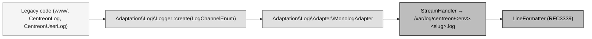

# Logging — Monolog layout and exception formatting

This document describes what the logging backport brings to `dev-24.10.x`:
the Monolog file layout, the RFC3339 line formatter and the global
exception-formatting processor. Reference: [MON-199096].

> **Scope on this branch.** `dev-24.10.x` has no new kernel / Symfony
> Messenger pipeline, so the `LoggingMiddleware` (bus dispatch logging) and
> the HTTP/security processors (`Web`, `Route`, `Token`, `Uid`) are **not**
> part of this backport. Only the Monolog configuration, the
> `monolog.formatter.line` service and the `ExceptionFormatter` /
> `ExceptionFormatterProcessor` pair are present here.

[MON-199096]: https://centreon.atlassian.net/browse/MON-199096

## Table of contents

1. [Monolog configuration](#1-monolog-configuration)
2. [RFC3339 line formatter](#2-rfc3339-line-formatter)
3. [`ExceptionFormatter` and `ExceptionFormatterProcessor`](#3-exceptionformatter-and-exceptionformatterprocessor)
4. [Output files and rotation](#4-output-files-and-rotation)
5. [Masking sensitive fields with `#[Sensitive]`](#5-masking-sensitive-fields-with-sensitive)
6. [Legacy bridge — `Adaptation\Log\Logger`](#6-legacy-bridge--adaptationloglogger)
7. [Writing authentication events](#7-writing-authentication-events)

## 1. Monolog configuration

The layout lives directly in `config/packages/monolog.yaml` (on `develop` /
the new kernel it is an `imports:` of `config.new/packages/monolog.yaml`;
since this branch has no `config.new/`, the content is inlined here).

A single catch-all `web_finger_crossed` → `web_file` handler captures every
channel except the excluded ones, and routes them to one file. It is declared
at the **top level** so the service resolves in every env (prod, dev, test):

```yaml
monolog:
    handlers:
        web_finger_crossed:
            type: fingers_crossed
            action_level: error
            excluded_http_codes: [404, 405]   # filters bot scans (/.env, /wp-admin…)
            buffer_size: 50
            stop_buffering: true
            handler: web_file
            channels:
                - "!event"
                - "!doctrine"
                - "!console"
                - "!deprecation"
                - "!authentication"
                - "!token"
                - "!password"
                - "!plugin-pack-manager"
                - "!upgrade"
            bubble: false
        web_file:
            type: stream
            path: "%kernel.logs_dir%/%kernel.environment%.web.log"
            level: debug
            formatter: monolog.formatter.line
```

**Exclusive filter.** Rather than a whitelist, a blacklist excludes channels
that have their own dedicated file or that are internal noise. Everything else
lands in the catch-all (`%env%.web.log`).

| Excluded channel | Reason |
|------------------|--------|
| `event`, `doctrine`, `console` | Internal Symfony / DBAL noise. |
| `deprecation` | Disabled in prod (`NullHandler`); dev writes `dev.deprecations.log`. Override the handler in a local `monolog.yaml` to re-enable — `prod.deprecations.log` is still declared in `logrotate/centreon`. |
| `authentication` | Dedicated file `%env%.access.log`. |
| `token` | Dedicated file `%env%.token.log`. |
| `password`, `plugin-pack-manager`, `upgrade` | Dedicated files. |

**`fingers_crossed` behaviour (prod).**

| Property | Effect |
|----------|--------|
| `type: fingers_crossed` + `action_level: error` | On success, `INFO`/`DEBUG` records are buffered in RAM and discarded at the end of the request — zero disk I/O. On the first `ERROR`, the whole buffer plus the triggering record are flushed. |
| `excluded_http_codes: [404, 405]` | A 404/405 response does not trigger the flush — bot scans (`/wp-admin`, `/.env`…) do not flood the file. |
| `stop_buffering: true` | After the triggering flush, the rest of the request writes directly. |
| `buffer_size: 50` | Memory cap; beyond it the oldest buffered records are dropped. |
| `bubble: false` | The record stops after this handler (no bubbling to other handlers). |

**`when@dev` override.** In dev, `action_level: debug` turns the handler into
a pass-through (every record flushed live) and `web_file` becomes a
`rotating_file` (`max_files: 14`) so local logs do not pile up. Dedicated
channel files are `rotating_file` too.

## 2. RFC3339 line formatter

Every handler uses the `monolog.formatter.line` service. On `develop` it is
declared in `config.new/services/shared.php`; on this branch it is declared in
`config/services.yaml`:

```yaml
monolog.formatter.line:
    class: Monolog\Formatter\LineFormatter
    arguments:
        $dateFormat: !php/const DateTimeInterface::RFC3339
```

Setting RFC3339 once at the service level means every handler emits its
timestamp as e.g. `2025-09-08T15:38:41+02:00` without repeating
`date_format:` on each handler. (`date_format:` is deliberately **not** set at
the handler level: on a `rotating_file` handler the Symfony Monolog Bundle
forwards it to `RotatingFileHandler` as the filename suffix, where RFC3339 is
invalid and throws at boot — cf. #10495.)

## 3. `ExceptionFormatter` and `ExceptionFormatterProcessor`

### `ExceptionFormatter`

`App\Shared\Infrastructure\Logging\ExceptionFormatter` is a dependency-free
utility that turns a `\Throwable` into a loggable `array<string, mixed>`:

```php
[
    'exceptions' => [
        ['type' => DomainException::class, 'message' => 'top',        'code' => 0, 'file' => '/.../Foo.php', 'line' => 42, 'trace' => [/* … */]],
        ['type' => RuntimeException::class, 'message' => 'mid',        'code' => 0, 'file' => '...',          'line' => 12, 'trace' => [/* … */]],
        ['type' => LogicException::class,   'message' => 'root cause', 'code' => 0, 'file' => '...',          'line' => 5,  'trace' => [/* … */]],
    ],
]
```

- The root exception is the first entry; every `previous` cause follows in
  order. The chain is **flat** — no nesting.
- `message` is truncated at 1024 characters (prevents a `PDOException`
  carrying a long SQL fragment from blowing up the log line width).
- `trace` is truncated at 15 frames (`Class::method() at file:line`); a final
  `… N frames omitted` entry signals how many were cut.
- The chain is capped at 20 entries; beyond that a trailing `@truncated` entry
  signals the cut. Every entry carries the **same six keys**
  (`type, message, code, file, line, trace`) so a consumer can iterate with a
  single shape.

### `ExceptionFormatterProcessor`

`App\Shared\Infrastructure\Logging\ExceptionFormatterProcessor` is a Monolog
processor registered **globally** (no channel filter) that detects a
`\Throwable` in the `context.exception` slot and applies
`ExceptionFormatter::format()` to it. It is idempotent: a record whose
`exception` key is already an array (or absent) is returned unchanged.

It is registered as a service in `config/services.yaml` and tagged
`monolog.processor` (on `develop` it is picked up via its `#[AsMonologProcessor]`
attribute through the `App\Shared` service loader, which does not exist on this
branch). Being global, it guarantees a uniform exception shape on every channel
for any emitter — e.g. ad-hoc `$logger->error('…', ['exception' => $e])` calls
or records emitted by Symfony's `ErrorListener`.

## 4. Output files and rotation

In production the `prod.*.log` files are rotated by **logrotate**
(`centreon/logrotate/centreon`, deployed to `/etc/logrotate.d/centreon`):

- `prod.web.log` (catch-all)
- `prod.access.log` (authentication)
- `prod.token.log`
- `prod.password.log`
- `prod.upgrade.log`
- `prod.plugin-pack-manager.log`
- `prod.deprecations.log` — not created by default (`NullHandler`); declared so an override re-enabling the handler inherits rotation (`missingok` covers the absent-file case).

Default retention: `weekly` × `rotate 52` (1 year), with `compress` +
`delaycompress` + `copytruncate`.

In development (`when@dev`) the handlers use `rotating_file` directly (daily
`Y-m-d` suffix, `max_files: 14`) — no logrotate needed.

### `prod.web.log` is a two-format file

`prod.web.log` aggregates records from **two writers** sharing the same file, and they don't share the same line shape — by construction, not by choice:

1. **Monolog** (the application framework, `LoggingMiddleware` + processors + every DI-resolved `LoggerInterface`) writes with the `LineFormatter`:

   ```
   [2026-05-20T14:30:00+02:00] app.INFO: Dispatching command.bus App\…\Foo {"dispatch_id":"…"} {"uid":"…"}
   ```

   - RFC3339 timestamp, `channel.LEVEL` prefix, JSON `context` + JSON `extra`.

2. **PHP-FPM** native `error_log` (`packaging/src/php-fpm.{rpm,deb}.conf`, `php_admin_value[error_log] = /var/log/centreon/prod.web.log`) writes whatever PHP cannot route through Monolog — parse errors, fatal pre-boot errors, OOM, `trigger_error(..., E_USER_ERROR)`:

   ```
   [20-May-2026 14:26:47 Europe/Paris] PHP Fatal error:  forced PHP test error in /tmp/foo.php on line 2
   ```

   - Legacy date format (`d-M-Y H:i:s T`), `PHP <Type> error:` prefix, no JSON.

The two formats **cannot be unified at the source**: PHP-FPM does not expose any `error_log_format` directive (the format is hardcoded in the PHP engine, `main/main.c`). What the framework can catch, however, is caught: `framework.php_errors.log: true` routes every runtime PHP `Warning` / `Notice` / `Deprecation` / `ErrorException` through Monolog on the `php` channel, so they land in `prod.web.log` **at the Monolog format**. Only the native pre-Monolog failures (parse error, fatal pre-boot, OOM) keep the PHP-FPM format.

Practical consequence for downstream consumers (log shippers, fail2ban filters, manual `tail`): match the line by **its first character pattern**, not by date:

- `^\[\d{4}-\d{2}-\d{2}T` → Monolog record (RFC3339)
- `^\[\d{2}-[A-Z][a-z]{2}-\d{4}` → PHP-FPM native error

---

## 5. Masking sensitive fields with `#[Sensitive]`

The keyword heuristic of the logging pipeline is permissive but **name-based**: it masks any key *containing* `password`, `token`, … and therefore misses a secret carried by an unlisted name. The `#[Sensitive]` attribute is the **explicit, type-safe** complement — it masks a field by *declaration*, regardless of its name.

### Attribute

`App\Shared\Domain\Logging\Attribute\Sensitive` can target properties, accessor methods, and classes:

```php
#[\Attribute(\Attribute::TARGET_PROPERTY | \Attribute::TARGET_METHOD | \Attribute::TARGET_CLASS)]
final readonly class Sensitive {}
```

- on a **property** — its value is masked;
- on a **method** (typically a getter) — the accessor key it exposes is masked (`getX`/`isX`/`hasX` → `x`, otherwise the raw method name);
- on a **class** — every value typed as that class is masked wholesale, so the sanitizer never descends into it.

Annotate any property whose value must never reach a log — plain properties or promoted constructor parameters:

```php
final readonly class SecretsCommand
{
    public function __construct(
        #[Sensitive] public string $passcode,
        #[Sensitive] public string $ssoTicket,
        public int $userId,
    ) {}
}
```

When such an object flows through the logging pipeline, the annotated values are rendered as `***`, while `userId` stays in clear.

### Pipeline

| Component | Role |
| --- | --- |
| `…\Domain\Logging\Attribute\Sensitive` | the marker placed on properties, accessor methods, and classes |
| `…\Infrastructure\Logging\Attribute\SensitivityScanner` | reflects a class, collects its `#[Sensitive]` properties and accessor keys, honours class-level sensitive types, and **recurses into nested class-typed properties**, so a secret nested in a sub-object is found too |
| `…\Infrastructure\Logging\PayloadSanitizer` | stateless walker that masks the `#[Sensitive]` values of a payload given its owning class (`contextClass`), falls back to the keyword denylist for raw array keys, **redacts secrets carried in a URL query string** (parameters whose name matches the denylist, e.g. in `extra.url`), and truncates string values at `MAX_VALUE_LENGTH` (1024) |
| `…\Infrastructure\Logging\SensitiveKeywordDenylist` | single source of truth for the keyword net (`password`, `token`, …) shared by `LogPayloadNormalizer` and `PayloadSanitizer`, so both nets mask the same field names |
| `…\Infrastructure\Logging\SanitizingProcessor` | Monolog processor that applies the sanitizer to every record's `context` (full masking) and `extra` (URL-query masking only — see below). Registered to run **last**, after the processors that fill `extra` |

The owning class is the **context** the sanitizer needs in order to know which keys are sensitive. On the command/query bus, `LoggingMiddleware` provides the dispatched message class, so `#[Sensitive]` on a Command / Query / DTO is honoured automatically. A **raw array** (`['secret' => $x]`) carries no class context, so the attribute layer cannot reflect it — but as the cross-channel net, `PayloadSanitizer` still applies the shared keyword denylist to its keys, so a `['password' => $x]` is masked everywhere it is logged. To get the explicit, type-safe attribute masking outside the bus, pass a typed object rather than a raw array.

`extra` is sanitised too, but with keyword-key masking **off**: its keys are produced by platform processors (`WebProcessor`, `TokenProcessor`, …), not by callers, and must stay readable for auditing (e.g. `extra.token` is `TokenProcessor`'s audit descriptor of the authenticated user — authenticated flag, roles, identifier — not a credential). There, only the sensitive query-string parameters of URL-like values are redacted (best-effort, query component only), covering a token passed in a request URL (`extra.url`). Because Monolog applies processors in reverse registration order and the MonologBundle **ignores the tag `priority`** for processors, the sanitizer is registered first (in `config.new/services/monolog.php`, and pushed first by `MonologAdapter`) so that it executes last — after `WebProcessor` has populated `extra`.

### Why not the native `#[\SensitiveParameter]`?

PHP's built-in [`#[\SensitiveParameter]`](https://www.php.net/manual/en/class.sensitiveparameter.php) is **not** a substitute here:

- **Target** — it is `Attribute::TARGET_PARAMETER` only, so it cannot annotate the many plain (non-promoted) **properties** we mask (`Contact::$token`, `Response::$message`, public DTO props such as `FindOpenIdConfigurationResponse::$clientId`, the legacy `Security/Domain/Authentication/Model/*`, …).
- **Mechanism** — it only redacts a value in **exception stack traces** (handled by the PHP engine); it does not mask log payloads. The scanner reflects *properties*, so it would not even see a `#[\SensitiveParameter]` placed on a promoted parameter.

A property-level attribute is therefore the right tool for reflection-based **payload** masking. A future enhancement could make `SensitivityScanner` *additionally* honour `#[\SensitiveParameter]` on promoted constructor parameters (gaining stack-trace redaction for free) while keeping `#[Sensitive]` for plain properties.

---

## 6. Legacy bridge — `Adaptation\Log\Logger`

The platform pipeline described above runs under `App\Shared\Infrastructure\Symfony\Kernel`. Legacy entry points (procedural `www/` code, classes wired through `App\Kernel`) cannot autowire Monolog services directly; they go through a thin façade so every record still lands on the same platform layout.



### `LogChannelEnum`

`Adaptation\Log\Enum\LogChannelEnum` enumerates the Monolog channels the legacy code is allowed to write to. The case value is the **channel name** (matches `config.new/packages/monolog.yaml`); `getLogFileSlug()` returns the **file-name slug** appended to `<env>.<slug>.log`.

| Case | Channel | File slug | Production file |
|---|---|---|---|
| `AUTHENTICATION` | `authentication` | `access` | `prod.access.log` |
| `PASSWORD` | `password` | `password` | `prod.password.log` |
| `PLUGIN_PACK_MANAGER` | `plugin-pack-manager` | `plugin-pack-manager` | `prod.plugin-pack-manager.log` |
| `TOKEN` | `token` | `token` | `prod.token.log` |
| `UPGRADE` | `upgrade` | `upgrade` | `prod.upgrade.log` |
| `WEB` | `web` | `web` | `prod.web.log` |

Only `AUTHENTICATION` carries a different slug — login/ldap/openid/saml records all converge in the shared `access.log` file.

### Module channels — `LogChannelInterface` and `ModuleLogChannel`

`LogChannelEnum` is a **closed** enum: it lists only the core platform channels, and a module (living in a separate repository, or under `centreon-dsm/`, `centreon-open-tickets/`, …) cannot add a case to it. To let a module own a **dedicated** log file that still flows through the unified pipeline (secret masking, exception formatting, `extra.uid`, web context), the channel is opened behind an interface:

```php
interface LogChannelInterface
{
    public function getChannelName(): string;               // Monolog channel tag
    public function getLogFileName(string $appEnv): string;  // file name, no directory
}
```

Two implementations:

| Implementation | `getChannelName()` | `getLogFileName($appEnv)` | Example file |
|---|---|---|---|
| `LogChannelEnum` (core) | the enum `value` | `{appEnv}.{slug}.log` | `prod.web.log` |
| `ModuleLogChannel` (modules) | the validated slug | the **literal historical name** (no `appEnv` prefix) | `license-manager.log` |

`MonologAdapter` depends on `LogChannelInterface` and **delegates the file name to the channel** (`getLogFileFromChannel()` no longer hard-codes `sprintf('%s/%s.%s.log', …)`), so a module channel gets the exact same platform processor stack as a core channel.

#### Historical file names are preserved

External consumers — ops runbooks, SIEM parsers, monitoring — watch some module logs **by their exact path**. A `ModuleLogChannel` therefore returns the **literal** historical file name, with **no `prod.` / env prefix**:

- `license-manager.log` (License Manager + PP Manager) — restored as a real dedicated file instead of being misrouted into `prod.upgrade.log`.
- `autodiscovery_job.log` (Auto Discovery).

> Only the **file name** is preserved. The **line format** necessarily changes to the platform one (`LineFormatter`, RFC3339 timestamp + JSON `context` / `extra`). If byte-for-byte format compatibility is required for a specific consumer of a given file, flag it explicitly.

These module files are **not** added to `centreon/logrotate/centreon` — that config covers the core `prod.*.log` files (see [§4](#4-output-files-and-rotation)). Each module keeps whatever log rotation its own module / packaging already provides; the unified pipeline only changes where the records are routed and how they are formatted, not who rotates the file.

#### `ModuleLogChannel`

`Adaptation\Log\Channel\ModuleLogChannel` is a `final readonly` value object that validates its slug **once at construction**, so every instance is guaranteed valid and immutable:

```php
use Adaptation\Log\Channel\ModuleLogChannel;
use Adaptation\Log\Logger;

Logger::create(new ModuleLogChannel('license-manager'))->error(
    'IMP API call failed',
    ['exception' => $e],
);
```

The slug is constrained to `^[a-z0-9]([a-z0-9_-]*[a-z0-9])?$/D` (lowercase alphanumerics, `-` / `_` separators, no leading/trailing separator). Since the slug becomes a file-name component, anything that could escape the log directory (`/`, `.`, `..`) or forge a log line (a newline — blocked by the `D` modifier) is rejected. An invalid slug throws `LoggerException`; a call site that builds a channel from a non-constant value must contain it (see `CentreonRestHttp` below).

The `ModuleLogChannel::fromLogFileName('license-manager.log')` factory strips a trailing `.log` then validates the result, so a legacy caller that passes a historical **file name** keeps working.

#### `CentreonRestHttp`

`CentreonRestHttp`'s second constructor argument accepts `string|LoggerInterface` (for backward compatibility): a historical caller passing `'license-manager.log'` is routed to a `ModuleLogChannel` automatically, while new code injects an explicit `Logger::create(new ModuleLogChannel(...))`. A malformed name never breaks the HTTP client — it degrades to a `NullLogger` and reports the rejected name (control characters stripped) through `error_log`.

### `Adaptation\Log\Logger`

```php
use Adaptation\Log\Enum\LogChannelEnum;
use Adaptation\Log\Logger;

Logger::create(LogChannelEnum::WEB)->error(
    'Could not generate the host configuration',
    ['host_id' => 42, 'exception' => $e],
);
```

`Logger::create()` returns a PSR-3 `LoggerInterface`. Internally it instantiates a `MonologAdapter` carrying a single `StreamHandler` configured with `LineFormatter` + `RFC3339`. Rotation is **not** wired at this layer — production hosts delegate to `logrotate` (cf. `logrotate/centreon`).

If `MonologAdapter::create()` cannot build the handler (e.g. permission error on the log directory), `Logger::create()` falls back to a `NullLogger` and writes the failure reason to `error_log()` — log emission must never break a request.

#### Processors attached by `MonologAdapter`

To mirror the platform pipeline as closely as possible without booting the Symfony container, `MonologAdapter::pushPlatformProcessors()` attaches three processors to every channel logger it creates:

| Processor | Source | Adds |
|---|---|---|
| `Monolog\Processor\UidProcessor` | Monolog vendor | `extra.uid` — 7-char hex id, **shared across every channel logger built in the current process** via a `private static` cache. Enables cross-file correlation (`grep "uid\":\"…\"" /var/log/centreon/*.log`) just like the new-kernel pipeline. |
| `Monolog\Processor\WebProcessor` | Monolog vendor | `extra.url`, `extra.ip`, `extra.http_method`, `extra.server`, `extra.referrer` — sourced from `$_SERVER` directly (the Symfony bridge variant is bypassed because its data is populated by a kernel-request listener that does not run from legacy code paths). |
| `App\Shared\Infrastructure\Logging\ExceptionFormatterProcessor` | platform | Unwraps `context.exception` through `ExceptionFormatter::format()`, producing the same nested-exception layout used on `prod.web.log` (cf. [§3](#3-exceptionformatter-and-exceptionformatterprocessor)). |

`RouteProcessor` and `TokenProcessor` are **not** wired here: they depend on the Symfony `RequestStack` / `TokenStorage` services and would be empty in the legacy stack. Records emitted via `Adaptation\Log\Logger` therefore do **not** carry `extra.controller`, `extra.route` or `extra.token`. Call sites that need those fields should write through the new-kernel pipeline (the catch-all `app` / `request` channels and every dedicated channel) where the full processor stack is wired globally by `config.new/services/monolog.php`.

#### Format alignment — no more `{custom, exception, default}` wrap

Before the legacy-logging migration, both `CentreonLog::log()` and `Centreon\Domain\Log\LoggerTrait::executeLog()` reshaped the `context` array before handing it to Monolog:

- `CentreonLog::buildContext()` pre-formatted the `Throwable` with `ExceptionLogFormatter` (legacy) and added `context.request_infos`.
- `LoggerTrait::normalizeContext()` rewrapped everything as `{custom, exception, default: {request_infos}}` — and **moved** the `Throwable` out of `context.exception` so `ExceptionFormatterProcessor` never saw it.

Both helpers are gone. The legacy façades now hand the caller-supplied `$context` directly to the underlying logger, only normalizing one thing: a `?Throwable $exception` argument is moved into `$context['exception']` so the platform processor can unwrap the chain on the way out.

Concrete consequences:

- Exceptions logged via `CentreonLog::create()->error(TYPE_*, 'msg', $ctx, $throwable)` end up with the **same** structured shape as the new-kernel records (handled by `App\Shared\Infrastructure\Logging\ExceptionFormatter`).
- The HTTP context (`url`, `ip`, `http_method`, `server`, `referrer`) lives under `extra`, not `context.request_infos` — that is where the rest of the platform reads it.
- `Core\Common\Infrastructure\ExceptionLogger\ExceptionLogger::log()` still pre-formats through `ExceptionLogFormatter` (legacy) for the `BusinessLogicException` `from_exception` / `traces` fields its callers rely on. Its records therefore keep the legacy `context.exception` shape — that is a property of `ExceptionLogger` callers, not of the underlying logger.

### Domain-specific facades

Four siblings of `Adaptation\Log\Logger` expose a **constrained, semantic API** instead of the raw PSR-3 surface:

| Facade | Channel | File | Methods |
|---|---|---|---|
| `Adaptation\Log\LoggerPassword` | `password` | `prod.password.log` | `success`, `warning` |
| `Adaptation\Log\LoggerToken` | `token` | `prod.token.log` | `success`, `warning` |
| `Adaptation\Log\LoggerAuthentication` | `authentication` | `prod.access.log` | `loginSuccess`, `loginFailure`, `logout`, `tokenRefreshSuccess`, `tokenRefreshFailure`, `unauthorized`, `forbidden` |
| `Adaptation\Log\LoggerUpgrade` | `upgrade` | `prod.upgrade.log` | `start`, `success`, `failure`, `step`, `stepCompleted`, `stepFailure`, `info`, `error` |

They exist for two reasons:

1. **Downstream consumers expect a stable JSON schema** — fail2ban filters (auth), SIEM correlation (password, auth, token), upgrade observability dashboards (upgrade). Hard-coding the schema in the helper guarantees every caller emits the same shape (`event`, `status`, `user_id`, `provider`, `ip_address`, `from_version`, …).
2. **OWASP-aligned semantics** — distinguishing a security event (`WARNING` for an attempted-but-refused login) from a technical crash (`ERROR` for an unhandled exception) is a domain concern; the helper enforces the right Monolog level for each method.

For channels that carry **free-form messages with arbitrary context** (`web`, `plugin-pack-manager`), call sites use `Adaptation\Log\Logger::create(LogChannelEnum::*)` directly — wrapping them in a helper adds no value over the PSR-3 facade.

Decision rule for adding a new `Logger<Channel>` class: when the channel either feeds an automated consumer that requires a stable schema, **or** carries a well-defined lifecycle (`loginSuccess` / `loginFailure` / `logout`, or `start` / `step` / `success` / `failure`) that benefits from semantic method names. Otherwise, route through `Adaptation\Log\Logger::create(LogChannelEnum::*)` directly.

### `CentreonLog` and `CentreonUserLog` façades

Both classes (`www/class/centreonLog.class.php`) keep their public surface but reroute every write through `Adaptation\Log\Logger`. The legacy `TYPE_*` identifiers map onto channels as follows:

| Legacy constant | Channel | Output file |
|---|---|---|
| `TYPE_LOGIN`, `TYPE_LDAP` | `AUTHENTICATION` | `prod.access.log` |
| `TYPE_SQL`, `TYPE_BUSINESS_LOG` | `WEB` | `prod.web.log` |
| `TYPE_UPGRADE` | `UPGRADE` | `prod.upgrade.log` |
| `TYPE_PLUGIN_PACK_MANAGER` | `PLUGIN_PACK_MANAGER` | `prod.plugin-pack-manager.log` |

`CentreonLog::pushLogFileHandler()` and `setPathLogFile()` are kept as deprecated no-ops for backward compatibility with extension modules — file routing is now driven exclusively by `LogChannelEnum`.

Both classes are tagged `@deprecated`. The DI/Application code that still autowires them keeps working, but **new code should call `Adaptation\Log\Logger` directly** with an explicit `LogChannelEnum`.

### `Centreon\Domain\Log\LoggerTrait`

`LoggerTrait` (~389 callers) keeps providing the PSR-3 helper shape used by Domain services that autowire a `LoggerInterface` via `#[Required]`. The former `ContactForDebug` gate is gone — `canBeLogged()` now only checks that a logger has been injected. The trait carries a descriptive note but no formal `@deprecated` tag, because `Symfony\Component\ErrorHandler\DebugClassLoader` would otherwise cascade the deprecation onto every class still using the trait during the transition.

### Symfony-side configuration

`config/packages/monolog.yaml` (legacy kernel) is a single-line `imports:` pointing at `config.new/packages/monolog.yaml`. There is one source of truth for channels, handlers and processors — adding or renaming a channel for the platform pipeline automatically reaches the legacy kernel too.

Both kernels resolve `kernel.logs_dir` to `/var/log/centreon` (`App\Kernel::getLogDir()` and `App\Shared\Infrastructure\Symfony\Kernel::getLogDir()`), so the path templates in `monolog.yaml` produce identical filenames regardless of which kernel boots a request.

---

## 7. Writing authentication events

Authentication is the only flow where the platform splits two destinations on purpose, following the [OWASP Logging Cheat Sheet](https://cheatsheetseries.owasp.org/cheatsheets/Logging_Cheat_Sheet.html) and [ASVS V7](https://owasp.org/www-project-application-security-verification-standard/) recommendations:

- **Application Security Events** → `prod.access.log` (channel `authentication`) — login success/failure, logout, token refresh, unauthorized, forbidden. Consumed by SOC / SIEM / fail2ban.
- **Application Error Logs** → `prod.web.log` (channel `web`) — exceptions, protocol diagnostics, dependency errors.

On this branch every auth provider routes through this split via the `LoggerAuthentication` facade (there is no new-kernel Symfony DI `monolog.logger.authentication` service here).

### Facade API

```php
use Adaptation\Log\Enum\AuthProviderEnum;
use Adaptation\Log\LoggerAuthentication;

LoggerAuthentication::create()->loginSuccess($message, $userId, $provider);
LoggerAuthentication::create()->loginFailure($message, $userId, $provider, $exception);
LoggerAuthentication::create()->logout($message, $userId, $provider);
LoggerAuthentication::create()->tokenRefreshSuccess($message, $userId, $provider);
LoggerAuthentication::create()->tokenRefreshFailure($message, $userId, $provider, $exception);
LoggerAuthentication::create()->unauthorized($message, $userId);
LoggerAuthentication::create()->forbidden($message, $userId, $resource);
```

| Method | Monolog level | When to use |
|---|---|---|
| `loginSuccess($message, $userId, $provider)` | `INFO` | Credentials accepted, session opened. |
| `loginFailure($message, $userId, $provider, $e)` | `WARNING` | Refused login: bad credentials, IP blacklisted, claim missing, IdP error. **WARNING, not ERROR** — this is an expected security event, not a crash. |
| `logout($message, $userId, $provider)` | `INFO` | Session ended. |
| `tokenRefreshSuccess($message, $userId, $provider)` | `INFO` | OIDC refresh token exchanged. |
| `tokenRefreshFailure($message, $userId, $provider, $e)` | `WARNING` | Refresh refused or token endpoint error during refresh. |
| `unauthorized($message, $userId)` | `WARNING` | Authenticated user not allowed to reach a resource (HTTP 401 outside of login). |
| `forbidden($message, $userId, $resource)` | `WARNING` | Authenticated user denied on a specific resource (HTTP 403). |

`$userId` is the Centreon `contact_id` (int). Pass `null` when the user is not yet resolved (early OpenID failure before the `userinfo` exchange, IP blacklist hit before authentication, …). `$provider` is an `AuthProviderEnum` case: `LOCAL`, `LDAP`, `OPENID`, `SAML`, `WEB_SSO`, `API_TOKEN`, `AUTOLOGIN`, `CLAPI`.

### Context structure

Every method emits the same JSON context shape:

```json
{
  "event": "login.success" | "login.failure" | "logout" | "token.refresh.success" | "token.refresh.failure" | "unauthorized" | "forbidden",
  "status": "success" | "failure",
  "user_id": 42,
  "ip_address": "10.0.0.42",
  "provider": "openid",
  "exception": { ... },
  "resource": "host:42"
}
```

- **Always present:** `event`, `status`, `user_id` (may be `null` before the user is resolved), and `ip_address` — which is the literal string `"unknown"` when `$_SERVER['REMOTE_ADDR']` is unset, notably for CLI / CLAPI events.
- **Conditional:** `provider` is omitted for `unauthorized` / `forbidden` (these carry no provider); `exception` appears only on the failure methods when a `Throwable` is passed; `resource` appears only on `forbidden` when a resource is supplied.

This shape is the contract — downstream filters and dashboards pin on `event`, `status`, `ip_address` and (where present) `provider`. Do not bypass the facade to add ad-hoc top-level keys.

### Recommended pattern in a provider

Inside the auth providers (`src/Core/Security/Authentication/...`), the rule is:

- **Login failures** → `LoggerAuthentication::create()->loginFailure(...)` at the exact point the decision is taken (just before throwing the SSO exception), where the user is usually not yet resolved (so `user_id` is `null`).
- **Login success** → emitted once by the `Login` use case after `findUserOrFail()` resolves the contact, so the event carries the real `user_id`. It is emitted only for the external providers (OpenID / SAML / WebSSO); local and LDAP success is already logged through the legacy `centreonAuth` path, which is excluded there to avoid a duplicate access-log entry.
- **Technical diagnostics** → `Adaptation\Log\Logger::create(LogChannelEnum::WEB)->info/error(...)` for the surrounding traces (request sent to IdP, JSON decode error, HTTP 5xx). These are not security events; they belong in `prod.web.log`.

```php
foreach ($conditions->getBlacklistClientAddresses() as $blackListedAddress) {
    if (preg_match('/' . $blackListedAddress . '/', $clientIp)) {
        // Security event — SOC needs to see this on prod.access.log.
        LoggerAuthentication::create()->loginFailure(
            'Client IP is blacklisted',
            null,
            AuthProviderEnum::OPENID
        );

        throw SSOAuthenticationException::blackListedClient();
    }
}

try {
    $response = $this->client->request('POST', $tokenEndpoint, ['body' => $data]);
} catch (Exception $exception) {
    // Security event — login refused, SOC needs to see it.
    LoggerAuthentication::create()->loginFailure(
        'Failed to retrieve access token from provider',
        null,
        AuthProviderEnum::OPENID,
        $exception
    );

    // Technical trace — kept on prod.web.log for ops investigation.
    Logger::create(LogChannelEnum::WEB)->error(
        sprintf('[Error] Unable to get Token Access Information:, message: %s', $exception->getMessage())
    );

    throw SSOAuthenticationException::requestForConnectionTokenFail();
}
```

### Other lifecycle events

```php
// Logout — emit when the session is closed (legacy logout button, OIDC end-session callback, SAML SLS).
LoggerAuthentication::create()->logout(
    sprintf("[%s] [%s] Logout for '%s'", $authType, $clientIp, $username),
    (int) $contactId,
    AuthProviderEnum::OPENID
);

// Token refresh — OIDC refresh_token exchanged successfully against the IdP.
LoggerAuthentication::create()->tokenRefreshSuccess(
    'OIDC refresh token exchanged successfully',
    (int) $contactId,
    AuthProviderEnum::OPENID
);
```

### Authorization events

```php
// API endpoint reached without a token, or with an expired one.
LoggerAuthentication::create()->unauthorized(
    'Missing or invalid bearer token',
    null
);

// Authenticated user denied on a specific resource by a voter or an ACL check.
LoggerAuthentication::create()->forbidden(
    'User cannot access host resource',
    (int) $user->getId(),
    'host:42'
);
```

### Application layer (DDD)

The DDD scope (`src/App/...`) calls `LoggerAuthentication` directly the same way as the legacy code — Application is allowed to depend on `Adaptation\Log\*` because that namespace is the platform-side wrapper, not a third-party I/O. If a particular use case wants strict DIP (Application depending on an abstraction, Infrastructure providing the adapter), define an `AuthenticationLoggerInterface` in `App\<Bounded>\Application\Logger\` and a `LoggerAuthenticationAdapter` in `App\<Bounded>\Infrastructure\Logger\` that delegates to the facade.

### Sample output

`prod.access.log`:

```
authentication.INFO: [local] [172.18.0.1] Authentication succeeded for 'admin'
  {"event":"login.success","status":"success","user_id":1,"provider":"local","ip_address":"172.18.0.1"}

authentication.WARNING: [local] [172.18.0.1] Authentication failed for 'admin' : invalid credentials
  {"event":"login.failure","status":"failure","user_id":null,"provider":"local","ip_address":"172.18.0.1"}

authentication.WARNING: No authorization code returned from external provider
  {"event":"login.failure","status":"failure","user_id":null,"provider":"openid","ip_address":"10.0.0.42"}

authentication.WARNING: Client IP is blacklisted
  {"event":"login.failure","status":"failure","user_id":null,"provider":"web-sso","ip_address":"10.0.0.42"}
```

> The `[local]` success/failure lines above originate from the legacy `centreonAuth` path (`CentreonUserLog` on the `authentication` channel), **not** from `LoggerAuthentication::loginSuccess()`: the `Login` use case deliberately skips local/LDAP to avoid a duplicate entry (see [§5 above](#recommended-pattern-in-a-provider)). The `openid` / `web-sso` lines are the ones emitted through the facade.

`prod.web.log` (same request, technical trace):

```
app.INFO: Start authenticating user... {"provider":"openid"}
app.ERROR: No authorization code returned from external provider {"provider":"openid"}
app.ERROR: An error occurred during authentication {"trace":"…SSOAuthenticationException…"}
```

### fail2ban compatibility

The legacy local/LDAP messages keep their historical pattern (`[local] [<ip>] Authentication succeeded for '<alias>'` / `Authentication failed for '<alias>' : <reason>`); the facade does not rewrite the message — the caller passes it verbatim as the first argument and only enriches the context.

But fail2ban jails are bound to a **file path** (`logpath = /var/log/centreon/login.log`), not to a message pattern: routing the events to `prod.access.log` alone would silently break existing jails. To avoid that, `LoggerAuthentication` also mirrors `loginSuccess` / `loginFailure` to the historical `login.log` in the original pipe-delimited format (`date|uid|page|option|message`), reproducing exactly what the legacy `centreonAuth` emitted through `CentreonUserLog::insertLog(TYPE_LOGIN)`. This duplicate write is transitional and will be removed in a future release once consumers read the Monolog access log instead. The same shim exists on the legacy path (`CentreonUserLog::insertLog`) for events still emitted through it (e.g. `LoginLogger`).

### Best practices

- **One decision point = one `loginSuccess` / `loginFailure` call.** No "summarising" loop log; emit the event where the throw / accept actually happens.
- **`WARNING`, not `ERROR`, for refused logins.** A bad password is a security event, not a crash. ERROR is reserved for true technical failures.
- **No PII, no secrets** in the message or the context. Mask tokens, redact passwords. The file is shipped to SOC pipelines.
- **`$userId` is `null` early, populated once resolved.** Don't fabricate a fake id (e.g. `0`) — `null` is the signal that the user was not authenticated at this stage.
- **Provider always set.** Use the `AuthProviderEnum` cases; do not pass a free-form string. The enum is the single source of truth of which providers exist.
- **Don't duplicate on both channels.** A security event goes to `prod.access.log` via the facade. The technical trace (stack trace, ldap_error, HTTP body) belongs to `prod.web.log` via `Logger::create(LogChannelEnum::WEB)`.

---

## 8. Writing upgrade scripts (`Update-*.php`)

> **24.10.x scope.** On this branch, upgrades run exclusively through the legacy web wizard (`process_step4/5` + `DbWriteUpdateRepository`). The DDD command path (`UpdateCommandHandler` / `DbalUpdateRepository`) is available from 25.10 onwards. The API table below documents both paths for completeness; only the legacy path applies here.

Each upgrade ships under `www/install/php/Update-<version>.php` (DB DDL/DML + business migration). It runs either through the DDD command — `UpdateCommandHandler` brackets each step with its `runStep()` helper and emits the logs, while `DbalUpdateRepository` only performs the operations (25.10+) — or through the legacy web wizard (`process_step4/5` + `DbWriteUpdateRepository`, which logs inline via `executeStep()`). Either way the `php_script` step is bracketed (start / completed / failure). **Inside the script itself, trace each meaningful action through `LoggerUpgrade` so operators get a play-by-play view in `prod.upgrade.log`.**

The legacy web upgrade splits the flow across two steps: `process_step4.php` runs the version updates (`runUpdate`), `process_step5.php` runs the post-update (`runPostUpdate`) under a `post_update` step — grep both when tracking a step name.

### Facade API

```php
use Adaptation\Log\LoggerUpgrade;

LoggerUpgrade::create()->info($version, "Adding column X to table Y");
LoggerUpgrade::create()->error($version, "Schema check failed", $exception);

LoggerUpgrade::create()->stepFailure($version, $stepName, $message, $exception);
LoggerUpgrade::create()->step($version, $stepName, $message);
```

| Method | Monolog level | When to use |
|---|---|---|
| `start($from, $to)` | `INFO` | Begin of the global upgrade flow (emitted by `UpdateCommandHandler` / `process_step4.php`, **not** by individual scripts). |
| `success($from, $to, $durationMs)` | `INFO` | End of the global upgrade flow, with measured duration. |
| `failure($from, $to, $message, $e)` | `ERROR` | Global upgrade aborted (catch-all in the handler). Emitted only once `start` has been emitted, so the lifecycle stays balanced; a failure raised **before** `start` (validation / lock / version read) is reported as an `upgrade.error` instead, never a dangling `failure`. |
| `step($version, $stepName, $message)` | `INFO` | Sub-step **start** / progress (`monitoring_sql`, `php_script`, …). `status: running`. Emitted by the repositories; rarely needed inside an upgrade script. |
| `stepCompleted($version, $stepName, $durationMs, $message)` | `INFO` | Sub-step **completion**. `status: completed`, carries `duration_ms` in the context (not just the message), so completed steps are queryable without parsing text. |
| `stepFailure($version, $stepName, $message, $e)` | `ERROR` | A bracketed step threw. Emitted by the step bracket itself (e.g. `UpdateCommandHandler::runStep`, `DbWriteUpdateRepository::executeStep`, or `process_step5.php` for `post_update`). An upgrade script must **not** re-emit it for `php_script` (the bracket already logs the re-thrown exception); a script only emits it for `php_script_rollback`, when the rollback itself fails. |
| **`info($version, $message)`** | `INFO` | **Trace a meaningful action** (entering a function, finished an `ALTER TABLE`, skipped because already migrated, …). This is the workhorse inside upgrade scripts. |
| **`error($version, $message, $e)`** | `ERROR` | Free-form error inside a script that you choose not to re-throw (rare — usually you re-throw and let the surrounding `try/catch` call `stepFailure`). |

### Recommended pattern

Start from `www/install/php/Update-next.php.tpl` — the canonical skeleton, kept in sync with the flow (its `try/catch`, transaction guard and rollback handling are ready to use). It is intentionally a bare skeleton; for a complete worked example of the points below, read the latest shipped script, e.g. `www/install/php/Update-24.10.28.php`. The shape:

- **Wrap each business action in its own callable** and set `$errorMessage` to a human description **before** running it — including immediately before `startTransaction()` and `commitTransaction()`, which are themselves distinct actions — so the final failure message reports which action actually failed.
- **Trace intent and outcome** with `info($version, …)`; log skip branches too — they prove the script is safely re-entrant.
- **Run DML inside a transaction** guarded by `isTransactionActive()`, and log "Rolling back…" only inside the `if` that actually rolls back.
- **On failure, just re-throw**, chaining the root cause as `previous`. The surrounding step bracket (`UpdateCommandHandler::runStep` / `DbWriteUpdateRepository::executeStep`) already logs the `php_script` `stepFailure` from the re-thrown exception, and the global flow (`UpdateCommandHandler` / `process_step4.php`) then writes the final `failure`. Do **not** emit a `php_script` `stepFailure` from the script — that double-logs the step. The only `stepFailure` a script emits itself is `php_script_rollback`, when the rollback fails. A silent return breaks the chain.

### Sample output (`prod.upgrade.log`)

```
upgrade.INFO: Upgrade started from 25.10.0 to 25.11.0
  {"event":"upgrade.start","status":"started","from_version":"25.10.0","to_version":"25.11.0"}
upgrade.INFO: Starting step 'php_script'
  {"event":"upgrade.step","status":"running","version":"25.11.0","step":"php_script"}
upgrade.INFO: Adding vmware_updated field into nagios_server table
  {"event":"upgrade.info","status":"info","version":"25.11.0"}
upgrade.INFO: Step 'php_script' completed in 124ms
  {"event":"upgrade.step_completed","status":"completed","version":"25.11.0","step":"php_script","duration_ms":124}
upgrade.INFO: Upgrade from 25.10.0 to 25.11.0 completed successfully
  {"event":"upgrade.success","status":"success","from_version":"25.10.0","to_version":"25.11.0","duration_ms":4242}
```

On failure, the step bracket writes `upgrade.step_failure` (ERROR) and the global flow writes a final `upgrade.failure` carrying the from→to versions and the wrapped exception.

### Best practices

- **One business action = one `info` line** before it runs (intent) and one after (outcome). Skip branches deserve their own line so operators can read the log top-to-bottom without re-deriving control flow.
- **Carry `$version` on every call** — the field is what lets SIEM/Grafana partition the file per release.
- **No PII, no secrets** in the message or the context. The file is shipped to operators / SOC pipelines; the same redaction rules as `prod.access.log` apply.
- **Don't duplicate the surrounding `step` log** — the repository already brackets the script with `step` / `stepFailure`. Inside the script, use `info` / `error` (free-form) and let `stepFailure` be raised by the outer `try/catch`.
- **Idempotent actions still log** — even "skipped because already migrated" is signal: it confirms the migration was applied on a previous run and the script is safely re-entrant.
- **Re-throw on failure**. Returning silently after logging masks the failure from the surrounding `UpdateCommandHandler` / `process_step4` which then misses the final `upgrade.failure` record.
